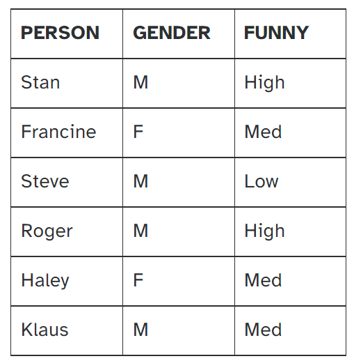
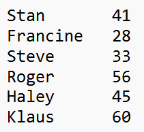

```{r setup, include=FALSE}
knitr::opts_chunk$set(echo = TRUE)
```

### Module 1 Exercise

- Create an R script which performs the following three tasks:

  - Create, store, and display a sequence of values from 5 to -11 that progresses in steps of 0.3.
  - Repeat the vector c(-1,3,-5,7,-9) twice, with each element repeated 10 times, store and display the result, then display the result, sorted from the largest value to the smallest.
  - Create, store, and display a vector containing 15 valuesin a sequence from 10 to 19.

```{r}

```

### Module 2 Exercise

- Step a: Use the vector c(2,4,6) and the vector c(1,2) in conjunction with rep and * to produce the  vector c(2,4,6,4,8,12).
- Step b: Create a 3x2 (3 rows, 2 cols) matrix from the vector created in Step a.
- Step c: Use cbind to add the vector c(3,6,9) to the matrix produced in Step b.
- Step d: Create a 3-dimensional (single-layer) array from the matrix produced in Step c.
- Step e: Provide an extraction expression which extracts the middle element (the value 8) from the array produced in Step d.
- Step f: Use the extraction expression from Step e (not the extracted value) to multiply all elements of the array produced in Step d by 8.

```{r}

```

### Module 3 Exercise

- Create and save the following data as a data frame, where the PERSON column is a character string and both GENDER and FUNNY columns are factors with M/F and Low/Med/High as levels, respectively.



- Use the str() function to verify the characteristics of each column.

- Add an AGE column to the data frame with the following ages:



- Then use column indexing to swap the AGE and FUNNY columns so AGE is the 3rd column and FUNNY is the 4th column.

- Add the following row to your data frame: "Sally", "F", 37, "High".

- Note that at this point str() indicates the AGE column is a character vector, not numeric. Convert that column to numeric.

- Display your final data frame and verify its structure (chr, factor, num, factor).

```{r}
```
