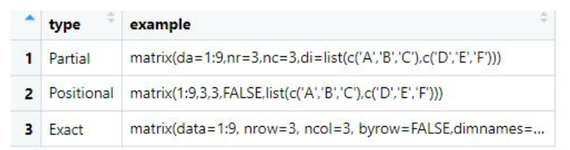
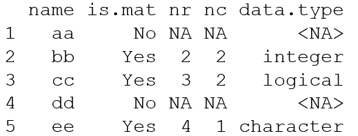

```{r setup, include=FALSE}
knitr::opts_chunk$set(echo = TRUE)
```

### Module 5 Exercise

- The following data frame provides examples of various argument matching types.

- Reproduce the data frame in R and write it to a .csv file (row.names=FALSE). Then delete the data frame from your environment, read the .csv file back in and display the data.



```{r}
# create the data frame (be very careful with those quotes!)
arg.matching <- data.frame(
        "type"=c("Partial","Positional","Exact"),
        "example"=c(
            "cat(c(1,2,3), file='', se=' ', fill=FALSE, lab=c('n1', 'n2', 'n3'), app=FALSE)",
            "cat(c(1,2,3), '', ' ', FALSE, c('n1', 'n2', 'n3'), FALSE)",
            "cat(c(1,2,3), file='', sep=' ', fill=FALSE, labels=c('n1', 'n2', 'n3'), append=FALSE)"
        )
)

# write to CSV file
write.csv(x=arg.matching,file='matrix-argmatching.csv',row.names=FALSE)

# delete from global environment
rm(arg.matching)

# read CSV file to recreate data frame
arg.matching <- read.csv(file='matrix-argmatching.csv')

# view it
#View(arg.matching)
```

### Module 6 Exercise

- Design a for loop which analyzes a list of various data types and characterizes the elements in a data frame

- Sample data:
  - aa=c(3.4,1)
  - bb=matrix(1:4,2,2), 
  - cc=matrix(c(T,T,F,T,F,F),3,2),
  - dd="string here",  
  - ee=matrix(c("red","green","blue","yellow"))

- Preallocate the data frame elements where possible

- Output:



```{r}
# Module 6 Exercise

# create the list
foo <- list(aa=c(3.4,1), bb=matrix(1:4,2,2), 
            cc=matrix(c(T,T,F,T,F,F),3,2),
            dd="string here",  
            ee=matrix(c("red","green","blue","yellow")))

# Obtain preliminary information and preallocate

name <- names(foo)             # get element names
is.mat <- rep(NA,length(foo))  # preallocate for testing for matrices
nr <- is.mat                   # preallocate for number of rows
nc <- is.mat                   # preallocate for number of columns
data.type <- is.mat            # preallocate for data type of each

# loop implementation
for (i in 1:length(foo)) {
      member <- foo[[i]]
      if(is.matrix(member)) {
              is.mat[i] <- "Yes"
              nr[i] <- nrow(member)
              nc[i] <- ncol(member)
              data.type[i] <- class(as.vector(member))
    } else {
        is.mat[i] <- "No"
    }
}

# create a data frame from the collected data items
bar <- data.frame(name,is.mat,nr,nc,data.type)
bar
```

### Module 7 Exercise

- A tutor knows that the length of time taken to complete a certain statistics question by first-year undergraduate students, X, is normally distributed with a mean of 17 minutes and a standard deviation of 4.5 minutes.

- What is the probability a randomly selected undergraduate takes more than 20 minutes to complete the question?

- What’s the chance that a student takes between 5 and 10 minutes to finish the question?

- Find the time that marks off the slowest 10 percent of students.

```{r}
# mean
mu <- 17
# s.d.
sigma <- 4.5

##(i)
# more than 20 minutes, subtract P(<=20) from 1
1-pnorm(20,mu,sigma)

##(ii)
# between 5 and 10 minutes, subtract P(<=5) from P(<=10)
pnorm(10,mu,sigma)-pnorm(5,mu,sigma)

##(iii)
# percentage questions require quantiles, find the
# boundary value at 10% using qnorm
slow10 <- qnorm(1 - 0.1,mu,sigma)
slow10
```

