```{r rmarkdown-setup, echo = FALSE}
knitr::opts_chunk$set(warning = FALSE)
knitr::opts_chunk$set(message = FALSE)
```

## Module 1

### History of R

-   R is a dialect of S, a language that was developed by John Chambers and
    others at the old Bell Telephone Laboratories, originally part of AT&T Corp.
-   S was designed for interactive data analysis (more command-line based) as
    well as for writing longer programs (more traditional programming
    language-like).
-   One key limitation of the S language was that it was only available in a
    commercial package.
-   R was created by Ross Ihaka and Robert Gentleman in the Department of
    Statistics at the University of Auckland. In 1993 the first announcement of
    R was made to the public.
-   In 1995, Martin Mächler made an important contribution by convincing Ross
    and Robert to use the GNU General Public License to make R free software.
-   In 1996, a public mailing list was created (the R-help and R-devel lists)
    and in 1997 the R Core Group was formed, containing some people associated
    with S and S-PLUS. Currently, the core group controls the source code for R
    and is solely able to check in changes to the main R source tree. Finally,
    in 2000 R version 1.0.0 was released to the public.

<https://bookdown.org/rdpeng/rprogdatascience/history-and-overview-of-r.html>

### What is Statistical Programming?

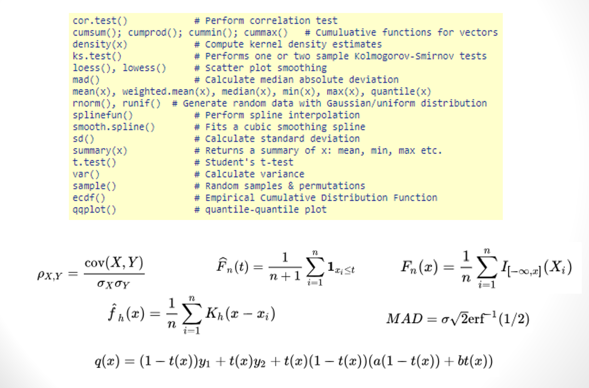

### Descriptive Statistics

-   Describe a sample
-   Summarize and graph group properties
-   Presented using numbers and graphs
-   No uncertainty, no inferences about larger populations
-   Common tools:
    -   mean/median - the center ("central tendency"); where most values occur
    -   range/standard deviation - how far from center does data extend
    -   skewness - whether a distribution is symmetric or skewed

### Example of Descriptive Statistics

-   Describe test scores of 30 students in a class

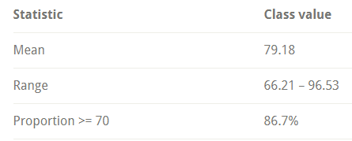

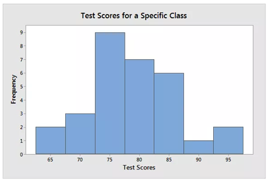


### Inferential Statistics

Makes inferences about larger populations using sample group

-   (Random) sample must accurately reflect population

Process can be complicated:

1.  Define population
2.  Draw representative sample from population
3.  Analyze and infer (sampling error must be considered)

Common tools:

-   hypothesis tests: two alternate theories, which is supported?
-   confidence intervals: range of likely values
-   regression analysis: validate observed relationships

### Example of Inferential Statistics

-   Same test used for descriptive statistics example, but now we want to draw
    inferences about a population

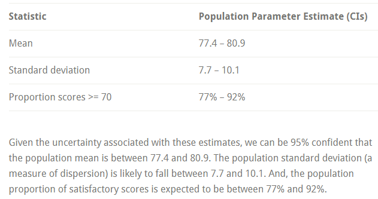

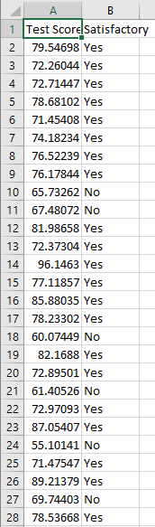

<http://statisticsbyjim.com/basics/descriptive-inferential-statistics/>

### Why R?

-   R is a sophisticated statistical programming language "tailored" for data
    science
-   Free, open source
-   Runs on any operating system
-   Produces high quality graphics
-   Diverse community
-   <https://twitter.com/search?q=%23rstats>
-   <https://meetup.com/topics/r-programming-language>
-   <https://rweekly.org>
-   <http://r-ladies.org>
-   Huge inventory of packages for modelling, machine learning, visualization,
    data manipulation

### Why NOT R?

-   Lack of elegant or well-maintained code base
-   Result-focused, not process-focused
-   Many R programmers do not reliably incorporate established software
    engineering practices (e.g. code control, automated testing)
-   Some R functions are obscure and some are inconsistent or unreliable
-   Contributed packages are inconsistent
-   Poor performance (especially for poorly written code) and high memory usage

### The R Project

-   CRAN (Comprehensive R Archive Network)

-   Download R program versions using CRAN mirrors at <http://www.r-project.org>

-   Website contains:

    -   Documentation
    -   Help
    -   Additional packages of analytical routines

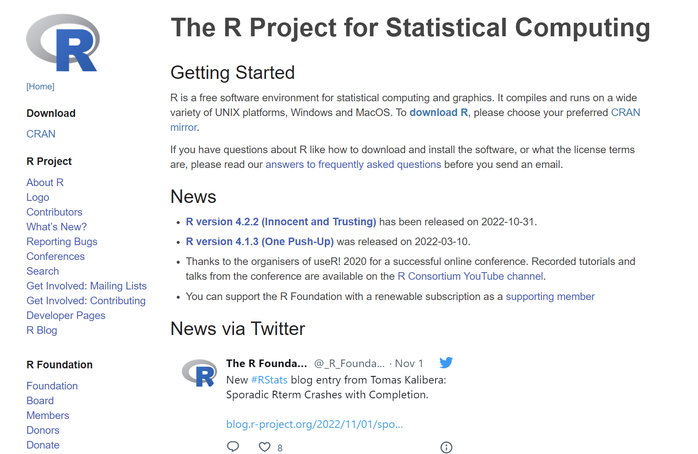

### Installing R

-   Visit R Project website at <http://www.r-project.org>
-   Click the download R link and select a mirror site
-   Choose your Operating System and click the link.
-   Follow the links for the appropriate version.
-   Download the installation file to your computer.
-   Run the installation file to install the program.
-   Install Rtools if desired (build custom packages).

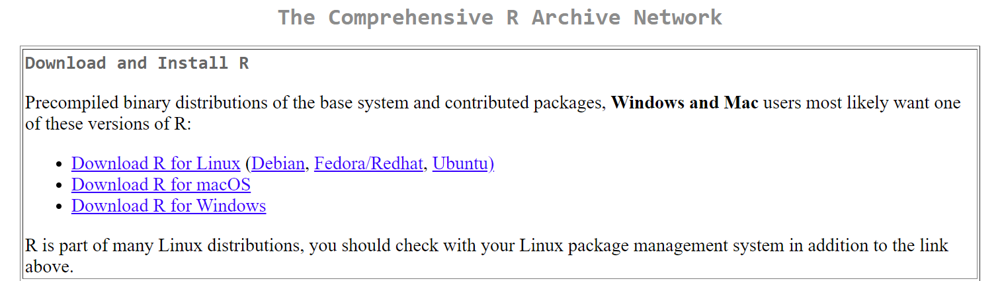

### Running R

-   R can run directly on the command line or in a basic GUI (not RStudio)
-   Type R on the command line (requires the correct PATH value) or use the
    desktop icon

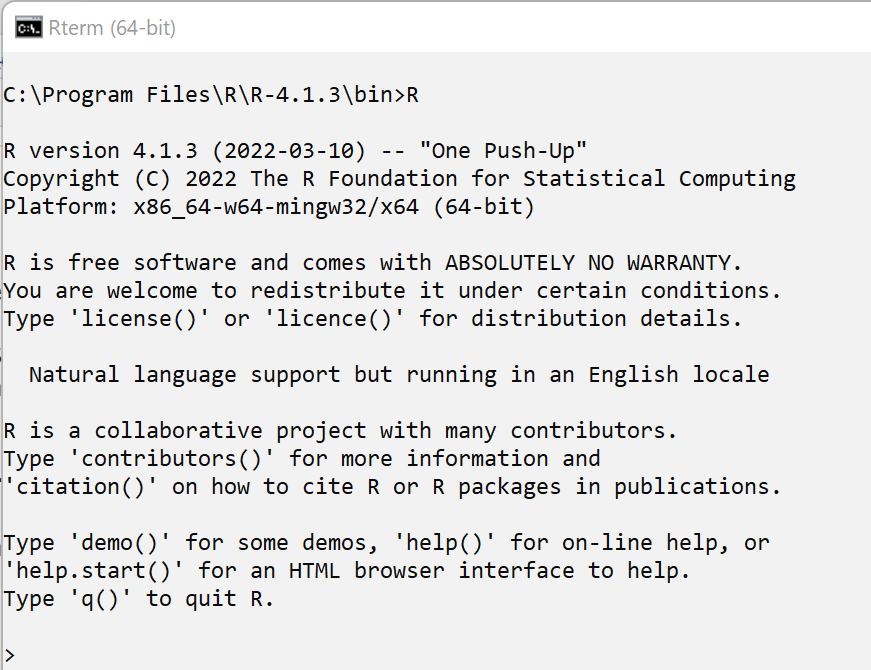 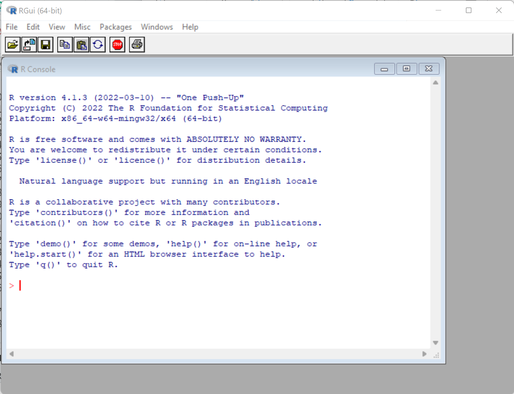 \# Getting Help

-   There are manuals and documentation on the R website.
-   R has extensive built-in help for commands
    -   ?topic to invoke help on a topic brings up a local HTML file containing
        the help information

**?mean**

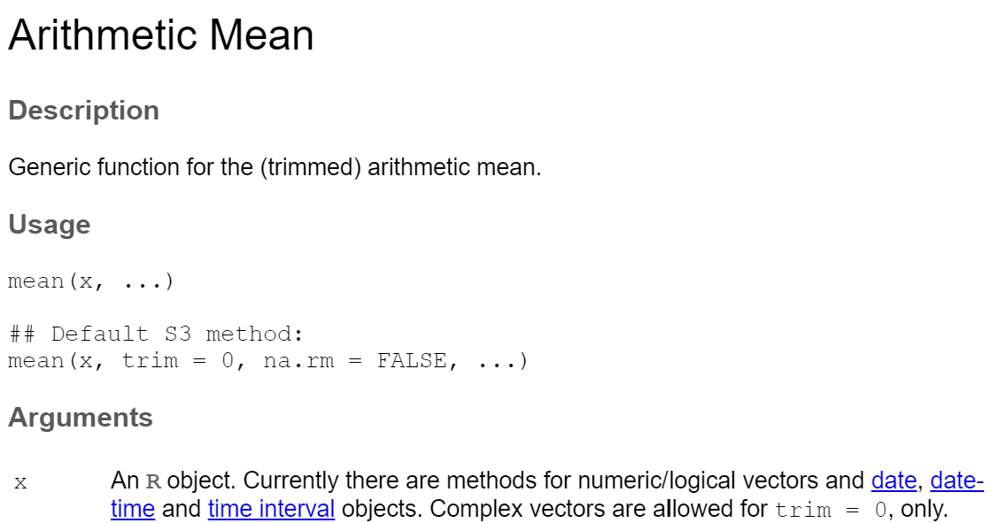

--------------------------------------------------------------------------------

### Try it yourself! Get help for the cat function by typing in the box provided below by typing ?cat

```{r}

```

### Anatomy of an R Help Entry

-   Similar to unix manual ("man") pages
-   Top shows command name and description
-   Middle shows common usage and instructions/parameters
-   Bottom shows references and examples

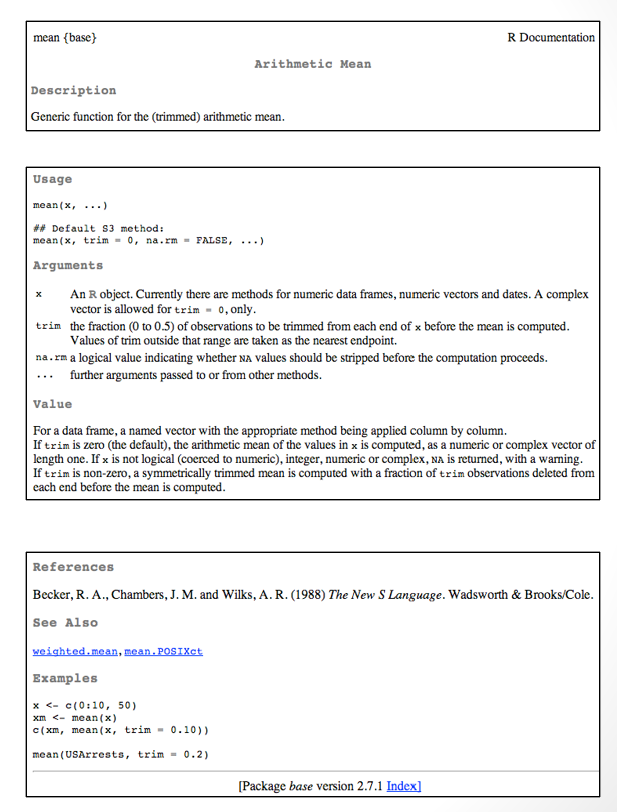

### Packages

-   The R program is split into packages.
-   A package is a collection of functions, data, and compiled code
-   The standard installation contains various packages.
-   Additional packages of analytical routines and utilities can be downloaded
    from the R website.
-   To see **currently installed and loaded** packages, type search()

### Try it!

```{r}

```

-   To list **all downloaded** packages, type installed.packages()

### Try it!

```{r}

```

### Typing in the R Console Window

-   The console is available directly from the command line, in the bundled R
    GUI, and in RStudio (bottom left pane)
-   The \> symbol shows where to type into R console window
-   Commands can spread over more than one line
-   If the cursor displays a + then some additional typing is required (usually
    a closing parenthesis)
-   Spaces are usually ignored
-   R can work like a simple calculator. type the expression into the R console
    and results are displayed immediately
-   Remember standard order of calculation: division and multiplication are
    evaluated before subtraction and addition
-   Use parentheses to ensure correct evaluation order

### R GUI Console

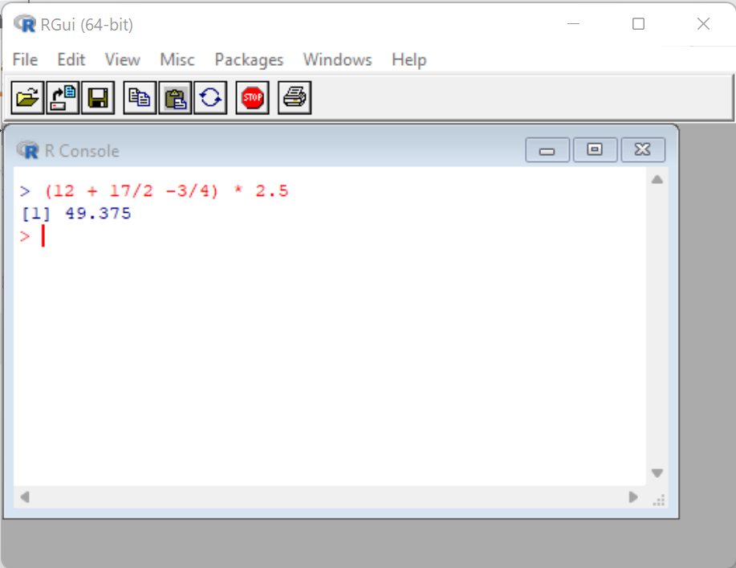 

### RStudio Console 

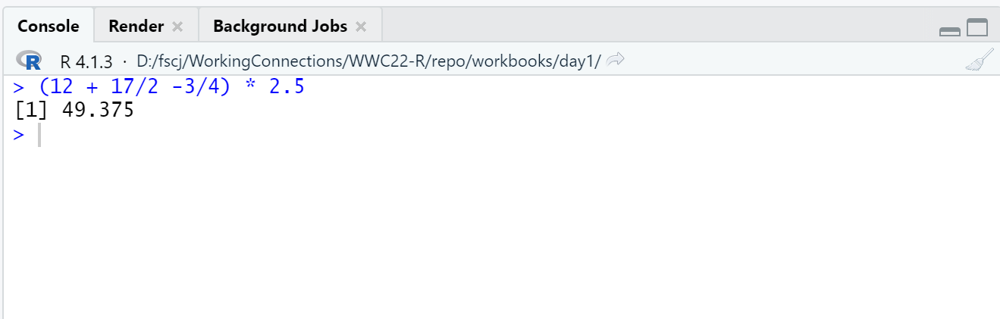

### Try it!

### Type (12 + 17/2 - 3/4) * 2.5

```{r}

```

### RStudio (company now known as **Posit**)

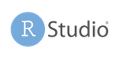

<https://www.rstudio.com/>
- IDE for R development
- Source editing, console (commands/input/output), environment, help, file management, package management
- Install R first, **then** download Rstudio Desktop (the free version)

### Using RStudio

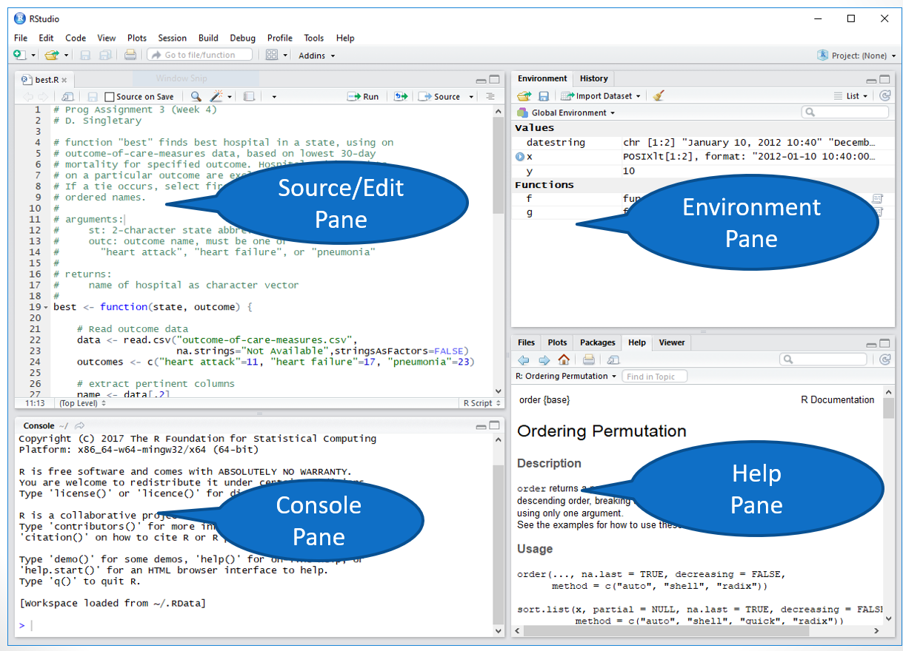

### R Objects and Assignment

-   R works on named objects ("everything is an object"), also known as
    variables
-   A calculation is assigned to a name to create or overwrite the named object
-   The R assignment operator is **\<-** !! (more on this later)
-   If a variable name is specified the result is not shown:
    -   ans1 \<- 23 + 14/2 - 18 + (7 \* pi/2)
    -   ans2 \<- 13 + 11 + (17 - 4/7)
    -   ans3 \<- ans2 + 9 - 2 + pi
-   You can type the object name to see the result:
    -   ans1
    -   [1] 22.99557

### Try it!

### Type the assignment statements shown above, then type one or more of the variable names on the next line

```{r}

```

- Objects can be assigned using a left-pointing arrow \<-

-   ans4 \<- 3 + 5

-   ans5 \<- ans1 \* ans2

-   The equal sign = also assigns a value, but is not preferred (it is normally
    used only for named arguments in function calls -- covered later)

    -   ans3 = ans2 + 9 - 2 + pi

    <https://renkun.me/2014/01/28/difference-between-assignment-operators-in-r/>

-   The arrow can be reversed (but don't!)

    -   ans3 + pi / ans4 -\> ans6

### Language Specifics

-   R is case sensitive
-   The set of symbols which can be used in R names depends on the operating
    system and country within which R is being run (depends on the locale in use
    on the system)
-   Normally all alphanumeric symbols are allowed (in some countries this
    includes accented letters) plus '.' and '\_',
-   Names are effectively unlimited in length
-   Elementary commands consist of either expressions or assignments
-   If an expression is given as a command, it is evaluated, printed (unless
    specifically made invisible), and the value is lost.
-   An assignment also evaluates an expression and passes the value to a
    variable; the result is not automatically printed
-   Comments can be put almost anywhere, starting with a hashtag ('\#');
    everything to the end of the line is a comment
-   If a command is not complete at the end of a line, R will give a different
    prompt (a plus sign +) on second and subsequent lines and continue to read
    input until the command is syntactically complete.

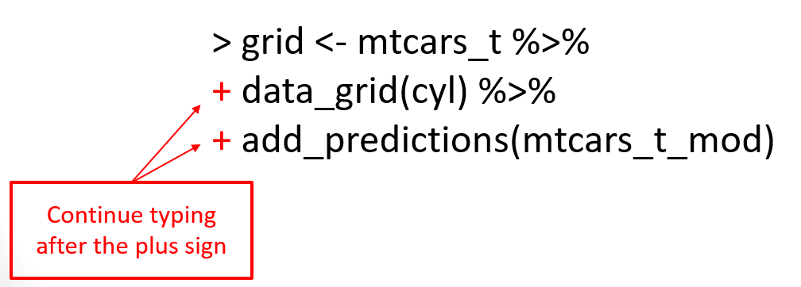

### Numeric Data

-   Numeric data in R is generically described as "numeric" but has a type of
    either integer or double precision ("double")
-   R's default preference is to use double precision
-   R will convert integer values to double unless you specify otherwise

```{r}
# use "typeof" to view internal representation
typeof(5)   # converts integer 5 to double
typeof(5.5)

# explicitly convert to integer
typeof(as.integer(5))
as.integer(5.5)
typeof(as.integer(5.5))
```

### Arithmetic

-   Standard arithmetic rules apply in R
-   Left-to-right evaluation
-   PEMDAS precedence
    -   Parentheses, Exponents, Multiplication, Division, Addition, Subtraction
-   Very large (and very small) numbers will display using scientific notation
    (e-notation)

```{r}
2342151012900
0.000000002533
```

### Functions

-   R has many built-in functions

-   The syntax of a function is

name(argument1, argument2, ...)

-   where name is the name of the function (usually) describes what it does,
    e.g.

```{r}
round(3.1415)
```

-   0 or more function arguments are passed to the function to determine its
    behavior

```{r}
# more function examples
seq(1,5)

toupper("convert this to upper case")

# assign function result to a variable "(named object)"
roundedPi <- round(3.1415)

# to see the value of an object, just type its name
roundedPi
```

-   To list assigned objects, use the ls() function

```{r}
ls()
```

-   Notice that if you leave off the parentheses, R shows the function's source
    code!

```{r}
ls
```

### Build-in Constants

-   R has a small number of built-in constants:
-   LETTERS: the 26 upper-case letters of the Roman alphabet
-   letters: the 26 lower-case letters of the Roman alphabet
-   month.abb: the three-letter abbreviations for the English month names
-   month.name: the English names for the months of the year
-   pi: the ratio of the circumference of a circle to its diameter

```{r}
LETTERS
letters
month.abb
month.name
pi
```

### Creating Simple Data Objects

-   A **vector** is a collection of primitive data types
-   Simple vectors of ordered sequences can be created using the : (colon)
    operator
-   You can also create a vector using the c() function ("combine")

```{r}
die <- 1:6
die

odds <- c(1, 3, 5, 7, 9)
odds
```

### Creating Text Data

-   Text (string) data is surround by quotes
-   You can use single ' ' or double " " quotes as long as each pair matches
-   There is no char (single character) type
-   The strings data type is referred to as **character**

```{r}
day1 <- c('Mon', 'Tue', 'Wed', 'Thu')
day1
```

# Viewing Output

-   Each line of output begins with an **index** value (we'll see more of these
    as we use more complex data values)

```{r}
# assign 3 to x and display its value
x <- 3
x
```

-   You can print an object using the print() function
-   There are many options available for the print command

```{r}
# ?print     # uncomment to show help page for print

x <- c(1,2,3,4,5)
print(x)

# round a number
x <- 10.4678
print(x, digits=3)

x <- "This is a sample string"
print(x)
# print with no quotes
print(x,quote=FALSE)
```

-   print() doesn't deal with multiple arguments; use cat() for this:

```{r}
# print("x =", x)  # this does not work, use cat instead
# cat concatenates its arguments
cat("x =", x, "\n")     # "\n" appends a newline
```

-   The structure function str() displays the internal structure of an object

```{r}
data1 <- c(3, 5, 7, 5, 3, 2, 6, 8, 5, 6, 9)
str(data1)
```

# Function Parameters

-   R passes function arguments by **value**, which means any changes you make
    to the arguments inside of a function are not seen by the caller of the
    function
-   Function calls can be nested

```{r}
die <- 1:6
die
mean(die)
round(mean(die))
```

-   R uses a rounding rule that is common in many programming languages: If the
    first digit dropped is a 5, always round to the nearest even number. For
    instance
    -   round(1.5) and round(2.5) both return 2
    -   On the negative side of the number scale, round(-4.5) returns -4

### The sample() function

-   Use the sample() function to simulate the roll of a single die

```{r}
die <- 1:6       # vector of values from 1 to 6

# sample() takes a pseudo-random sample of size 1 from the vector
sample(die, 1)
sample(die, 1)
sample(die, 1)
```

### Named Function Arguments

-   Arguments for R functions have names, which we can specify using the = sign
-   This allows us to pass arguments in any order

```{r}
sample(x=die, size=1)

# call sample with size argument first
sample(size=1, x=die)
```

-   If you do not specify the argument names, you must be sure to pass the
    arguments in the correct order. 
-   Uncomment the code below and see what happens when you execute it (hint: an error occurs)
    -- the required order is sample(die, 1)

```{r}
#sample(1, die)
```

-   In this example, we get an error on the 'die' argument if it is specified as the size

-   If you aren't sure of the argument ordering or argument names, you can call
    the args() function with the function name to find out:

```{r}
args(sample)
```

-   Notice that there are additional arguments for the sample function
    (**replace** and **prob**). These are *optional* arguments, if not provided,
    they are assigned default values as shown above.

- You can also type the function name without parentheses and look at the first line of the output

```{r}
sample    # view the function arguments
```

### Viewing Your Objects in the RStudio Environment Pane

- In R Studio, you can view your objects in the environment pane (upper right corner)

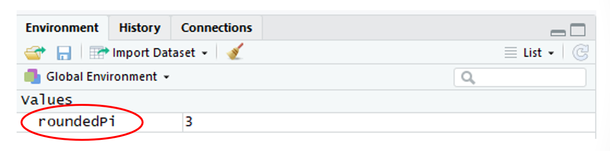

### Clearing Your Objects

- We sometimes need to "clean the slate" and clear our environment after creating many objects
- This can be done in the console

```{r}
rm(list=ls())
```

- In R Studio, you can clear objects from your environment by clicking on the "broom" icon in the environment pane (upper right corner)

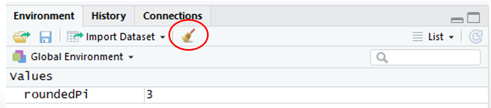

### Creating an R Script

- Create a script by using a text editor or R studio

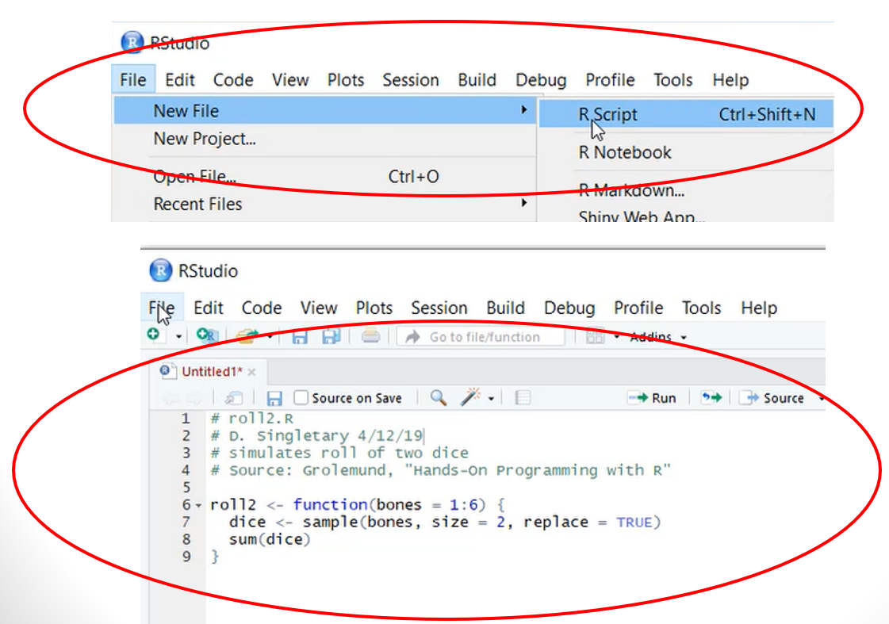

### Saving R Scripts
- Use "Save As" from the RStudio File menu
- Save a script file as plain text, using the .R extension (extension will automatically be applied in RStudio)
- Check/set working directory with getwd()/setwd() before saving!

```{r}
getwd()
```

### Installing Packages
- Download a zip file from the R Project website.
- Use the install.packages command in the R console:
      **install.packages("name")**
- CRAN packages by name:
      <https://cran.r-project.org/web/packages/available_packages_by_name.html>
- To uninstall a package:
      **uninstall.packages("name")**
- Once downloaded and installed packages need to be loaded into R before use:
      **library(name)**
- To unload a package:
      **detach(package:name)**
      
### Citations

- Recognition of R contributors and attribution of R and contributed packages is expected when publishing research and results
- R provides a citation() function which will provide this information for your use
- Calling this function with no arguments provides citation information for R in general

```{r}
citation()
```

- Calling citation() with a package name will provide citation information for that packages

```{r}
# need the package installed before it can be cited
# try without specifying a mirror first, otherwise use 'repos' option
# install.packages('tidyverse')
# install.packages('tidyverse', repos='http://cran.us.r-project.org')
# citation("tidyverse")
```
