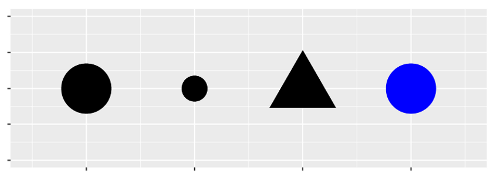
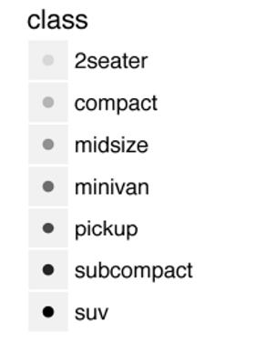
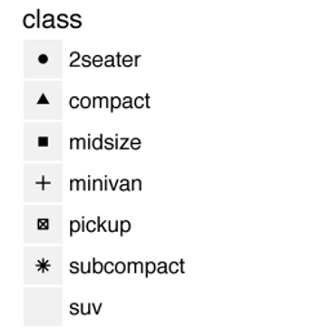

```{r rmarkdown-setup, echo = FALSE}
knitr::opts_chunk$set(warning = FALSE)
knitr::opts_chunk$set(message = FALSE)
```

## Module 10

## Introduction to the Tidyverse


- "The tidyverse is an opinionated collection of R packages designed for data science. All packages share an underlying design philosophy, grammar, and data structures."

  - core packages are ggplot2, dplyr, tidyr, readr, purrr, tibble, stringr, and  forcats, which provide functionality to model, transform, and visualize data

  - <https://tidyverse.org>
  
  - The package emphasizes functional programming, a programming strategy which uses mathematical functions and expressions

- While popular, the tidyverse is not without its critics

  - In particular, the functional programming emphasis makes it difficult for non-programmers to use
  
  - <https://github.com/matloff/TidyverseSkeptic>
  
## Loading the Tidyverse

```{r}
# repos only needs to be specified when knitting
#install.packages("tidyverse", repos='http://cran.us.r-project.org')
#library(tidyverse)
```

- You only need to install a package once, but you need to reload it (via library) every time you start a new R session

### Version Warnings and Updating Base R

- When you load packages you may see warnings about your version of R.
- If the library fails to load you can use the following commands from within RStudio to update your baseR version:

> install.packages("installr")
> library(installr)
> updateR()

- Be sure to check package documentation before upgrading in case your package doesn't support a more recent version of R.

### Data Visualization with ggplot2

### Answering Questions with Visualization

- Do cars with big engines use more fuel than cars with small engines?
  - The answer is intuitive but visualization of the data can make it precise
  - What does the relationship between engine size and fuel efficiency look like?

- The mpg Data Frame
  - Test your intuition using the mpg data frame found in the ggplot2 package (ggplot2::mpg).
  - A data frame is a rectangular collection of variables (in the columns) and observations (in the rows)
    - A tibble is a "modern reimagining" of a data frame (Wickham)
  - mpg contains observations collected by the US Environment Protection Agency on 38 models of cars

```{r}
# be sure to install and load the tidyverse
# package in the previous chunk (uncomment if necessary)
mpg
```

### The ggplot2::mpg Data Frame

- Among the variables in mpg are:
  - displ, a car’s engine size, in liters
  - hwy, a car’s fuel efficiency on the highway, in miles per gallon (mpg)
    - A car with a low fuel efficiency consumes more fuel than a car with a high fuel efficiency when they travel the same distance
- enter ?mpg to learn more

### Creating a ggplot

```{r}
# put displ on the x-axis and hwy on the y-axis:
ggplot(data = mpg) +
  geom_point(mapping = aes(x = displ, y = hwy))
```

### ggplot Basics

- ggplot() creates a coordinate system to which layers can be added.
- The first argument of ggplot() is the dataset to use in the graph
  - ggplot(data = mpg) creates an empty graph, but it’s not very interesting
- Complete the graph by adding one or more layers to ggplot()
  - The geom_point() function adds a layer of points, which creates a scatterplot.
  - ggplot2 comes with many geom functions that add a different type of layer to a plot

- The mapping argument defines how variables in your dataset are mapped to visual properties
- The aes() function adds "aesthetic mappings" which map to variables in the data
  - The x and y arguments of aes() specify which variables to map to the x- and y-axes
  - ggplot() looks for the mapped variables in the data argument (e.g. the mpg data frame)

### The mpg Plot

- We can move the aesthetic mapping of the variables into the ggplot function, then the point layer specification is simpler.
- We can also add a trendline using the lm function.

```{r}
ggplot(data = mpg, aes(displ,hwy)) +
  geom_point() + geom_smooth(method = "lm")
```

- The plot shows a negative relationship (downward trendline) between engine size (displ) and fuel efficiency (hwy). 
- In other words, cars with big engines use more fuel.

### Aesthetic Mappings

- An aesthetic is a visual property of the objects in your plot 
  - Aesthetics include things like the size, the shape, or the color of your points. 
- You can display a point in different ways by changing the values of its aesthetic properties, called "levels". 
  - For instance, changing the levels of a point’s size, shape, and color can make the point small, triangular, or blue:



- You can add a third variable to a two-dimensional scatterplot by mapping it to an aesthetic
  - map the colors of your points to a third variable "class" to reveal the class of each car:

```{r}
ggplot(data = mpg) + geom_point(
     mapping = aes(x = displ, y = hwy, color = class))
```

- To map an aesthetic to a variable, associate the name of the aesthetic to the name of the variable inside aes() 
- ggplot() will automatically assign a unique level of the aesthetic (e.g. a unique color) to each unique value of the variable, a process known as scaling
  - ggplot() will also add a legend that explains which levels correspond to which values
- We can map class to the size aesthetic in the same way.
  - In this case, the exact size of each point would reveal its class affiliation. 
  - Note: mapping an unordered variable (class) to an ordered aesthetic (size, e.g. smallest to largest) is not a good idea

```{r}
 ggplot(data = mpg) + geom_point(
               mapping = aes(x = displ, y = hwy, size = class))
# Warning: Using size for a discrete variable is not advised
```

### Other Aesthetic Mappings

- alpha (transparency)



- shape
  - (note that by default, only6 shapes are used, additionalpoints are unmapped)
  


### x and y Aesthetics

- Once you map an aesthetic, ggplot() selects a reasonable scale to use with the aesthetic, and constructs a legend that explains the mapping between levels and values
- For x and y aesthetics, ggplot() does not create a legend, but it creates an axis line with tick marks and a label
  - The axis line acts as a legend; it explains the mapping between locations and values
  - You can also set the geom aesthetic properties manually
  - For example, to make all of the points in the mpg plot blue:

```{r}
ggplot(data = mpg) + geom_point(
   mapping = aes(x = displ, y = hwy), color = "blue")
```

### Facets

- Another way to add variables, particularly useful for categorical variables, is to split your plot into facets
  - facets are subplots that each display one subset of the data

```{r}
ggplot(data = mpg) +
     geom_point(mapping = aes(x = displ, y = hwy)) +
     facet_wrap(~ class, nrow = 2)
```

### The facet_wrap Function

- facet_wrap wraps a 1 dimensional sequence of panels into 2 dimensions
  - The first argument of facet_wrap() should be a formula
  - The variable that you pass to facet_wrap() should be discrete (not continuous)

### The R Formula Operator ~

- The tilde operator ~ characterizes formulas in R
- The variable on the left-hand side of a tilde (~) is the dependent variable, while (one or more) variables on the right-hand side are independent variables
  - If there are more than one independent variable they are joined by plus signs +
  - A left-hand side variable is not required, as shown in the above example

### Two-Variable Faceting with facet_grid()

- To facet your plot with a combination of two variables, add facet_grid() to your plot call
  - The first argument of facet_grid() is also a formula. This time the formula should contain two variable names separated by ~

```{r}
ggplot(data = mpg) +
        geom_point(mapping = aes(x = displ, y = hwy)) +
        facet_grid(drv ~ cyl)
```

### Geometric Objects

- A geom is the geometrical object that a plot uses to represent data 
  - Plots are often described by the type of geom that the plot uses
  - e.g. bar charts use bar geoms, line charts use line geoms 
  - boxplots use boxplot geoms
  - scatterplots use the point geom
- Different geoms can be used to plot the same data
- To change the geom in your plot, change the geom function that you add to ggplot()

```{r}
# use point geom
ggplot(data = mpg) +
      geom_point(mapping = aes(x = displ, y = hwy))

# use smooth geom
ggplot(data = mpg) +
      geom_smooth(mapping = aes(x = displ, y = hwy))
```

- Use appropriate aesthetics

- Not every aesthetic applies to every geom; setting the shape for a line geom doesn't make sense. 
- Line types, however, do make sense for the line geom
  - e.g. use ggplot() to map a different line type to each drive train value (f = front-wheel drive, r = rear-wheel drive, 4 = 4-wheel drive)

```{r}
ggplot(data = mpg) +
        geom_smooth(mapping = 
             aes(x = displ, y = hwy,
                 linetype = drv))
```

- The group aesthetic groups the display of multiple objects for a categorical variable

```{r}
ggplot(data = mpg) +
        geom_smooth(mapping = aes(x = displ, y = hwy, group = drv))
```

- ggplot() will automatically group the data when you map an aesthetic to a discrete variable

```{r}
ggplot(data = mpg) + geom_smooth(mapping =
         aes(x = displ, y = hwy, color = drv))
```

- ggplot2 provides a + operator to plot multiple geoms
- It works similar to the 'pipe' operator (see Module 12's modelr package)
- "...if I'd discovered the pipe earlier, there never would've been a ggplot2" - Hadley Wickham
- Here's a shortcut to display multiple geoms in the same plot

```{r}
ggplot(data = mpg, 
      mapping = aes(x = displ, y = hwy)) +
      geom_point() + geom_smooth()
```

- If you place mappings in a geom function, ggplot() will treat them as local mappings for the specific layer
  - ggplot() will use these mappings to extend or overwrite the global mappings for that layer only.
  - This makes it possible to display different aesthetics in different layers

```{r}
ggplot(data = mpg, mapping = aes(x = displ, y = hwy)) +
  geom_point(mapping = aes(color = class)) +
  geom_smooth()
```

- Layer-Specific Data

- Use the filter function to isolate data components
  - Here the smooth line displays a subset of the mpg dataset, the subcompact cars
  - The local data argument in geom_smooth() overrides the global data argument in ggplot() for that layer only

```{r}
ggplot(data = mpg, mapping = aes(x = displ, y = hwy)) +
      geom_point(mapping = aes(color = class)) +
      geom_smooth(data = filter(mpg, class == "subcompact"),
                  se = FALSE)
```

- Note: se = FALSE refers to the display of the confidence interval.     - This results in a "shadowed" line, which we avoid here by using se = FALSE

### Workflow: Basics

- Chapter 2 in R for Data Science (Workflow: Basics) is a short review of some basic R concepts, read through the content to be sure you're caught up on those basics before continuing on to the next section.

### Data Transformation with dplyr

- dplyr provides a set of tools for efficiently manipulating datasets in R
<https://blog.rstudio.com/2014/01/17/introducing-dplyr/>
- dplyr uses data frames and tibbles
- Three underlying concepts:
  - performance
  - cross-compatibility: anything you can do to a local data frame you can also do to a remote database table
    - PostgreSQL, MySQL, SQLite and Google bigquery support is built-in
  - Individual functions that correspond to the most common operations
    - Each function does one only thing, but does it well

### nycflights13 Dataset

- nycflights13 contains airline on-time data for all flights departing NYC in 2013
  - Also includes useful 'metadata' on airlines, airports, weather, and planes.
  
- Loading dplyr masks some basic R functions:

  - -- Conflicts ----------------------------
  - tidyverse_conflicts() --
  - x dplyr::filter()     masks stats::filter()
  - x .GlobalEnv::first() masks dplyr::first()
  - x dplyr::lag()        masks stats::lag()

- In order to use the masked functions, use the qualified :: name:
  - e.g stats::filter(), stats::lag()

```{r}
install.packages("dplyr")
library(dplyr)
library(nycflights13)
flights
```

- Flight Data - Data Types

  - int refers to integers
  - dbl refers to for doubles, or real numbers
  - chr is used for character vectors, or strings
  - dttm is date-time (a date + a time)
    - R refers to these as POSIXct
  - There are three other common types of variables that aren’t used in this dataset:
    - lgl refers to logical, vectors that contain only TRUE or FALSE.
    - fctr is factors, which R uses to represent categorical variables with fixed possible values
    - date refers to dates

```{r}
View(flights)
```

### Basic dplyr Functions

- There are 6 basic functions used in dplyr:
  - pick observations by their values: filter()
  - reorder the rows: arrange()
  - pick variables by their names: select()
  - create new variables with functions of existing variables: mutate()
  - collapse many values down to a single summary: summarize()
  - apply functions on a group-by-group basis: group_by()
    - group_by() is used with the above five functions

- filter()

- filter() allows you to subset observations based on their values
  - The first argument is the name of the data frame
  - The second and subsequent arguments are the expressions that filter the data frame

```{r}
# Select all flights on January 1st
filter(flights, month == 1, day == 1)
```

- filter() results are immutable

  - dplyr functions never modify their inputs; to save the result use the assignment operator

```{r}
jan1 <- filter(flights, month == 1, day == 1)
```

  - To both print results and save them, wrap the expression in parentheses:

```{r}
(dec25 <- filter(flights, month == 12, day == 25))
```

- Floating Point Representation

  - As with most programming languages, R uses IEEE 754 as the basis for representation of floating point numbers
  
```{r}
# square root of 2 squared should be 2
sqrt(2) ^ 2 == 2

# 1/49 * 49 should be 1
1/49 * 49 == 1
```

  - Instead of relying on ==, use near():

```{r}
near(sqrt(2) ^ 2,  2)
near(1 / 49 * 49, 1)
```

- Missing Values

- NA represents an unknown value so missing values are “contagious”; almost any operation involving an unknown value will also be unknown:

```{r}
NA > 5
10 == NA
NA + 10
NA / 2
NA == NA
```

```{r}
# Let x be Mary's age. We don't know how old she is.
x <- NA

# Let y be John's age. We don't know how old he is.
y <- NA

# Are John and Mary the same age?
x == y
# We don't know!
```

- filter() and Missing Values

- If you want to determine if a value is missing, use is.na():
```{r}
x <- NA
is.na(x)
```

- filter() only includes rows where the condition is TRUE; it excludes both FALSE and NA values. If you want to preserve missing values, ask for them explicitly:

```{r}
df <- tibble(x = c(1, NA, 3))
df
filter(df, x > 1)
filter(df, is.na(x) | x > 1)
```

- arrange()

- arrange() works similarly to filter() except that instead of selecting rows, it changes their order
  - If you provide more than one column name, each additional column will be used to break ties in the values of preceding columns

```{r}
arrange(flights, sched_dep_time, year, month, day)
```

- Use desc() to reorder by a column in descending order:

```{r}
arrange(flights, desc(dep_delay))
```

- Missing values are always sorted at the end:

```{r}
df <- tibble(x = c(5, 2, NA))
df
arrange(df, x)
arrange(df, desc(x))
```

- select()

- select() allows you to rapidly zoom in on a useful subset using operations based on the names of the variables

```{r}
# Select columns by name
select(flights, year, month, day)
```

- select() also allows exclusion of columns

```{r}
# Select all columns except those from year to day
select(flights, -(year:day))
```

- There are a number of helper functions you can use within select():

  - starts_with("abc") matches names that begin with “abc”
  - ends_with("xyz") matches names that end with “xyz”
  - contains("ijk") matches names that contain “ijk”

- Another option is to use select() in conjunction with the everything() helper.
- This is useful if you have a handful of variables you’d like to move to the start of the data frame

```{r}
select(flights, time_hour, air_time, everything())
```

- summarize()

- summarize() is an aggregation function
  - aggregation functions apply a single function to multiple rows or groups of rows
  - summarize() can collapse a data frame to a single row

```{r}
# calculate overall average of flight delas
summarize(flights, delay = 
            mean(dep_delay, na.rm = TRUE))
```

- group_by()

- group_by() changes the unit of analysis from the complete dataset to individual groups

```{r}
# calculate average delay by date
by_day <- group_by(flights, year, month, day)
summarize(by_day, delay = mean(dep_delay, na.rm = TRUE))
```

### The Pipe Operator %>%

- The pipe operator forwards a value, or the result of an expression, into the next function call/expression
  - A function to filter data can be written as:

    - filter(data, variable == numeric_value) 

    -   -or- 

    - data %>% filter(variable == numeric_value)

- Both functions complete the same task and the benefit of using %>% may not be immediately evident; however, when you desire to perform multiple functions its advantage becomes obvious

- If we want to filter some data, group it by categories, summarize it, and then order the summarized results we could write it out using multiple objects:

```{r}
a <- filter(mtcars, carb > 1)
b <- group_by(a, cyl)
c <- summarize(b, Avg_mpg = mean(mpg))
d <- arrange(c, desc(Avg_mpg))
print(d)
```

- or using pipes:

```{r}
mtcars %>%
        filter(carb > 1) %>%
        group_by(cyl) %>%
        summarize(Avg_mpg = mean(mpg)) %>%
        arrange(desc(Avg_mpg))
```

- Behind the scenes, x %>% f(y) turns into f(x, y), and x %>% f(y) %>% g(z) turns into g(f(x, y), z), and so on
- You can use the pipe to rewrite multiple operations in a way that you can read left-to-right, top-to-bottom
- Pipes are used frequently in R because they improve the readability of code

- Missing Values

  - aggregation functions obey the rule of missing values: if there are any missing values in the input, the output will be a missing value

```{r}
flights %>%
     group_by(year, month, day) %>%
     summarize(mean = mean(dep_delay))
```

- All aggregation functions have an na.rm argument which removes missing values prior to computation:

```{r}
flights %>%
       group_by(year, month, day) %>%
       summarize(mean = mean(dep_delay, na.rm = TRUE))
```

