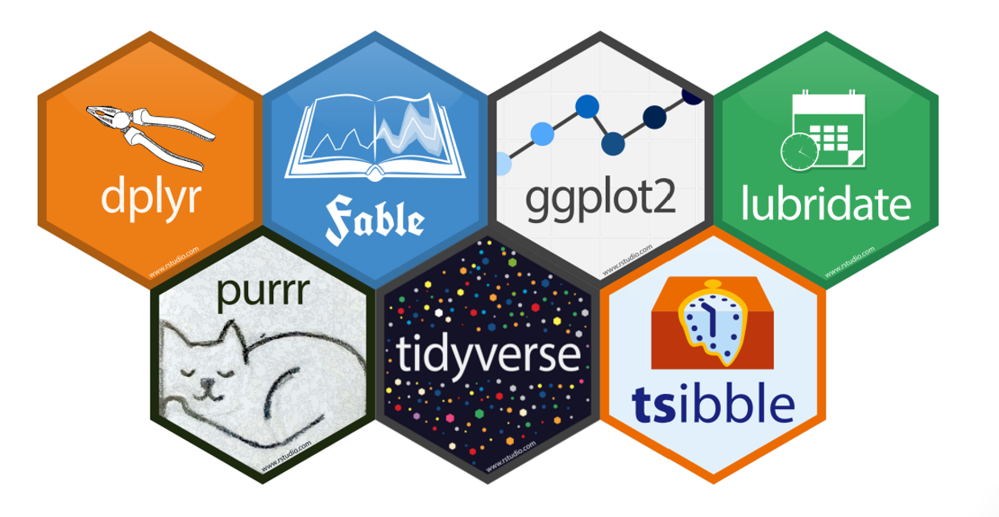

```{r rmarkdown-setup, echo = FALSE}
knitr::opts_chunk$set(warning = FALSE)
knitr::opts_chunk$set(message = FALSE)
```

## Module 10

## Introduction to the Tidyverse



- "The tidyverse is an opinionated collection of R packages designed for data science. All packages share an underlying design philosophy, grammar, and data structures."

  - core packages are ggplot2, dplyr, tidyr, readr, purrr, tibble, stringr, and  forcats, which provide functionality to model, transform, and visualize data

  - <https://tidyverse.org>
  
  - The package emphasizes functional programming, a programming strategy which uses mathematical functions and expressions

- While popular, the tidyverse is not without its critics

  - In particular, the functional programming emphasis makes it difficult for non-programmers to use
  
  - <https://github.com/matloff/TidyverseSkeptic>
  
## Loading the Tidyverse

```{r}
#install.packages("tidyverse")
#library(tidyverse)
```

- You only need to install a package once, but you need to reload it (via library) every time you start a new R session


### Data Visualization with ggplot2 

