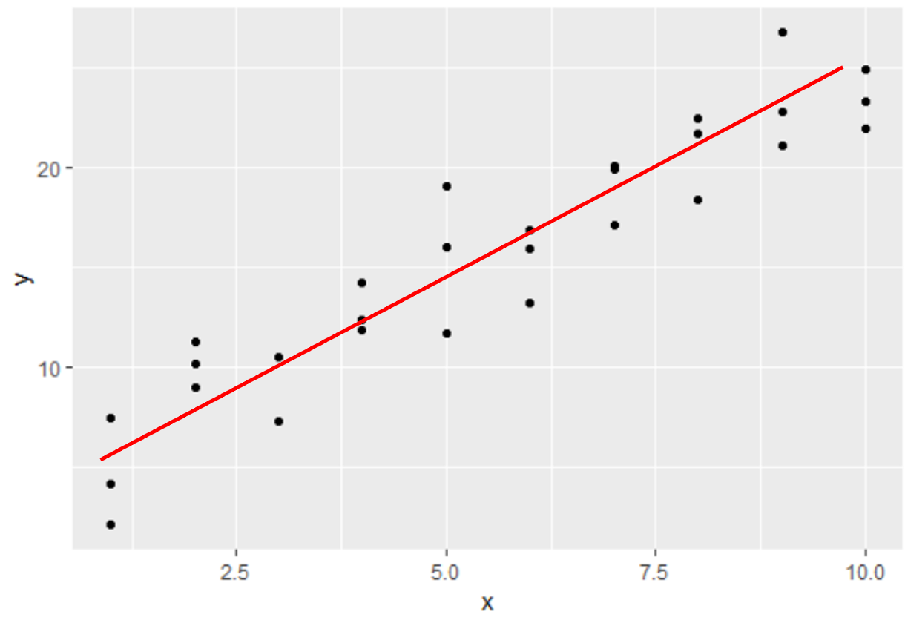
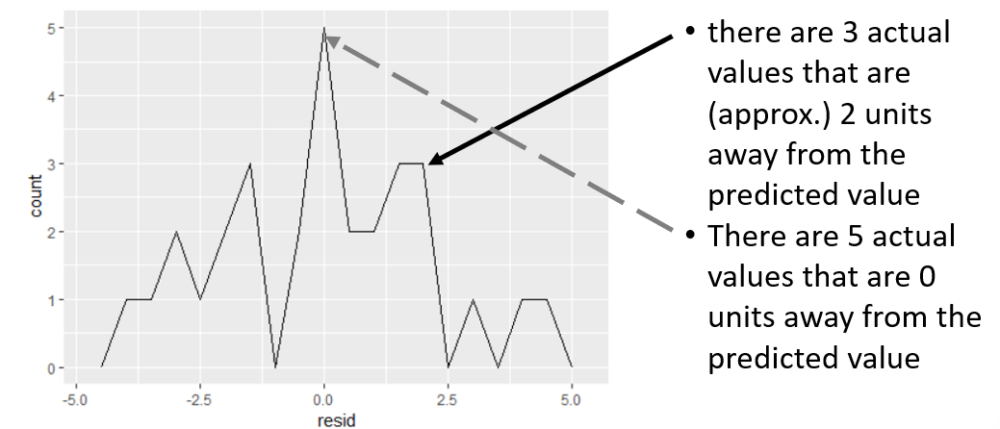

```{r rmarkdown-setup, echo = FALSE}
knitr::opts_chunk$set(warning = FALSE)
knitr::opts_chunk$set(message = FALSE)
```

## Module 11

## Modeling Data with the Tidyverse

### Model Basics with modelr

### Introduction to Models

- Models provide simple summaries of datasets
- They can be used to partition data into patterns and residuals (differences between observed and predicted values of data)

- There are two types of models:

  - A **generic** model which expresses a pattern, e.g.

    - y = a * x + b    or    y = a * x ^ b

  - x and y are known variables from your data
  - a and b are parameters, or coefficients, that can vary to capture different patterns
  
  - A **fitted** model using a specific form of the generic model, e.g.

    - y = 3 * x + 7    or    y = 9 * x2

  - a fitted model is just the closest, "best" model from a family of generic models

### Approximation

- Models look like noisy clouds of points
- Having the “best” model doesn’t imply that you have a good model

  - "All models are wrong, but some are useful."
  - George Box <https://en.wikipedia.org/wiki/George_E._P._Box>

- The goal of a model is not to determine absolute truth, but to discover a simple approximation that is still useful
- There are many different ways to model data, each with its own theoretical backing

### The modelr Toolkit

- modelr wraps around base R’s modeling functions to make them work naturally in a pipe

- sim1 is a simple dataset (30 x 2) in the modelr toolkit for learning modeling concepts

```{r}
library(tidyverse)
library(modelr)
options(na.action = na.warn) # handle missing values with a warning
sim1
# plot the dataset
ggplot(sim1, aes(x, y)) + geom_point()
```

- The pattern in the sim1 plot is readily apparent as an upward sloping line (bottom left to upper right)



- The formula for the line is 

  - y = mx + b

- where m is the slope and b is the y-intercept

- How can we model this?

### The runif Function

- The runif() (Random Uniform) function generates a random distribution of values between a lower and upper bound
  - Useful when simulating data for probability problems
  - As more samples are generated, the data will take the form of a normal distribution (bell curve)
- To generate n values between lower and upper:
  - runif(n, lower, upper) 

```{r}
runif(10, 1, 5)  # 10 values between 1 and 5
```

- compare 50 random lines layered on the sim1 plot; are any of these a good fit?

```{r}
models <- tibble(y = runif(50, -20, 40), m = runif(50, -5, 5))
ggplot(sim1, aes(x, y)) + 
  geom_abline(aes(intercept = y, slope = m), 
    alpha = 1/4, data = models) + 
  geom_point()
```

- Some of the lines in the random mapping may be a good fit, but we need a precise method to determine the best fit

- Linear regression models the relationship between predictor and response variables.
  - The lm() (linear model) function in R performs linear regression to model linear relationships (fit linear models)

    - lm(formula, data)

- formula is of the form y ~ x
  - y is the dependent variable
  - x is (one or more) independent variables
  - "y is a function of x"
  
- y ~ x as an argument to lm() will translate to the function

  - y = mx + b       (the slope and intercept are implicit)

- lm() actually finds the closest model in a single step using a sophisticated algorithm
  - The coef() function extracts the coefficients of the model as a numeric vector

```{r}
sim1_mod <- lm(y ~ x, data = sim1)
coefs <- coef(sim1_mod)
ggplot(sim1, aes(x, y)) +
     geom_abline(aes(intercept = coefs[1], slope = coefs[2])) +
     geom_point()
```

### Validating and Visualizing Models

- One approach used to validate a model is to visualize predicted values (expected results) 
- The modelr package provides several useful functions to do this
  - Start by generating a sequence of values to use for predictions that covers the region where the data lies using the modelr::data_grid() function
  - Argument is a data frame or tibble
  - Increments between values will not necessarily be consistent

```{r}
grid <- sim1 %>% data_grid(x)
grid
```

- modelr::add_predictions() uses a model to make predictions from a dataset

```{r}
sim1_mod <- lm(y ~ x, data = sim1) 
grid_p <- grid %>% add_predictions(sim1_mod)
grid_p
```

- pred is a new column added by the add_predictions function that we can use to plot the model

```{r}
ggplot(sim1, aes(x)) +
     geom_point(aes(y = y)) +
     geom_line(aes(y = pred),  
               data = grid_p,
               colour = "red",
               linewidth = 1)
```

### Residuals

- Predictions tell you the pattern that the model represents, residuals tell you what the model has missed
- Residuals are just the distances between the observed and predicted values
- modelr::add_residuals() works in a similar fashion as add_predictions(), but we use original data instead of a fabricated grid

```{r}
sim1.R <- sim1 %>%
      add_residuals(sim1_mod)
sim1.R
```

- A frequency polygon can show the accuracy of the predictions (distance between predicted and actual values)

```{r}
ggplot(sim1.R, aes(resid)) +
  geom_freqpoly(binwidth = 0.5)
```



### Plotting the Residuals

```{r}
# note the randomness of the plotted points
ggplot(sim1.R, aes(x, resid)) +
      geom_ref_line(h = 0) +
      geom_point()
```

### Categorical Variables

- sim2 is a modelr dataset containing categorical variables a, b, c, and d

```{r}
ggplot(sim2) +
  geom_point(aes(x, y))
```

- Use lm to fit a model to a dataset with categorical variables, and add_predictions to generate predictions

```{r}
mod2 <- lm(y ~ x, data = sim2)
grid <- sim2 %>%
         data_grid(x) %>%
         add_predictions(mod2)
grid
```

- In general terms, a model with a categorical x will predict the mean value for each category
- This can be seen by plotting the predictions over the original data points

```{r}
ggplot(sim2, aes(x)) +
    geom_point(aes(y = y)) +
    geom_point(
        data = grid,
        aes(y = pred),
        color = "red",
        size = 4)
```

- Calculate the residuals for our categorical data using add_residuals

```{r}
sim2.R <- sim2 %>% add_residuals(mod2)
ggplot(sim2.R, aes(resid)) +
     geom_freqpoly(binwidth = .5)
```


