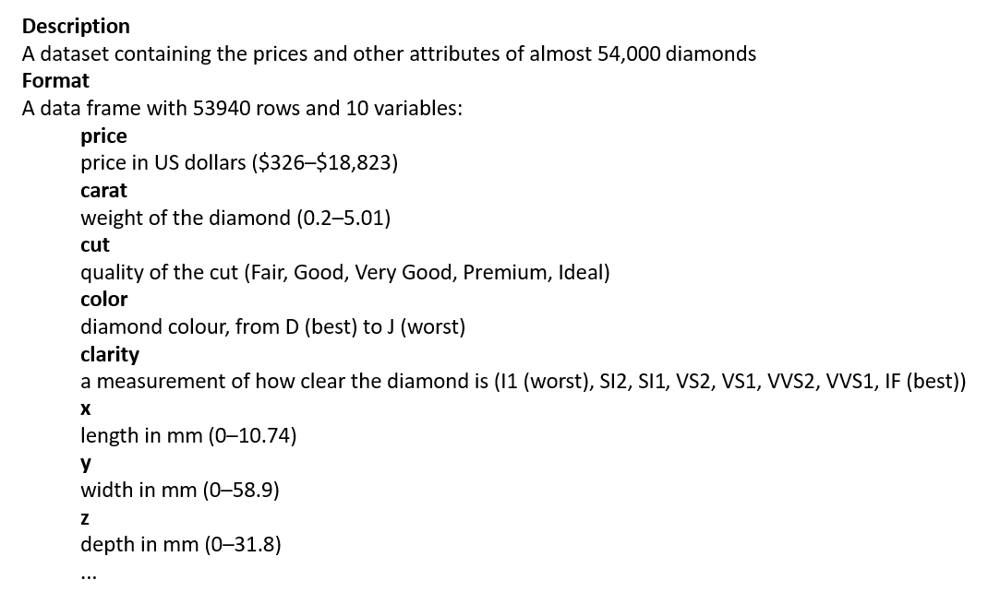
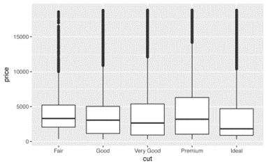
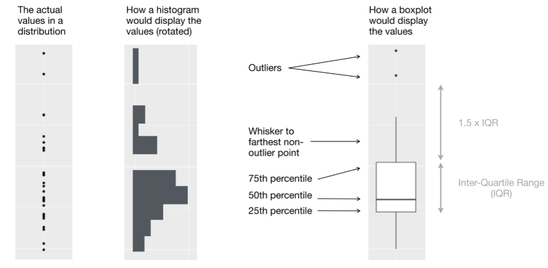

```{r rmarkdown-setup, echo = FALSE}
knitr::opts_chunk$set(warning = FALSE)
knitr::opts_chunk$set(message = FALSE)
```

## Module 12

## Visualizing Data with the Tidyverse

### Exploratory Data Analysis (EDA)

- Exploratory data analysis (EDA) is a process of investigating data that is analogous to detective work
  - Data is systematically investigated from different perspectives until a "story" emerges
  - <https://www.oxfordbibliographies.com/view/document/obo-9780199828340/obo-9780199828340-0200.xml>

- A working hypothesis is generated
  - "outliers" (extreme values) and invalid assumptions are identified
  - "Let the data speak for themselves" – use visualizations to construct the story and then communicate it to stakeholders
  - <https://hbr.org/2013/04/how-to-tell-a-story-with-data>

### The EDA Process

- EDA is an iterative process
  - Generate questions about data
  - Search for answers by visualizing, transforming, and modeling the data
  - Refine the questions and generate new ones

- Questions may lead to useful information, but not always

### EDA Terminology

- Two types of questions will always be useful for making discoveries within your data:
  - What type of variation occurs within my variables?
  - What type of covariation occurs between my variables?
- Terminology
  - A variable is a quantity, quality, or property that you can measure
  - A value is the state of a variable when you measure it
    - The value of a variable may change from measurement to measurement
  - An observation, or a case, is a set of measurements made under similar conditions
  - An observation will contain several values, each associated with a different variable. 
  - Tabular data is a set of values, each associated with a variable and an observation
- In tidy data*:
  - Each variable forms a column. 
  - Each observation forms a row. 
  - Each type of observational unit forms a table.

- * Wickham, Journal of Statistical Software

### Variance

- Variance ("variation" is used in the text) is the tendency of the values of a variable to change from measurement to measurement
  - You can see variation easily in real life; if you measure any continuous variable twice, you will usually get two different results
- Categorical variables can vary if you measure across different subjects (e.g., the eye colors of different people), or different times (e.g., the energy levels of an electron at different moments)
  - Every variable has its own pattern of variation, which can reveal interesting information
  - The best way to understand that pattern is to visualize the distribution of the values

- ggplot2 contains a dataset (tibble) named "diamonds"



```{r}
library(tidyverse)
diamonds
# this may take awhile to run
ggplot(data=diamonds, aes(x=carat, y=price)) + geom_point()
```

- Remember the difference between continuous and categorical variables:
  - A variable is categorical if it can only take one of a small set of values
  - Categorical variables are usually saved as factors or character vectors

```{r}
# Use a bar chart to visualize the categorical cut variable distribution
ggplot(data = diamonds) + 
         geom_bar(mapping = aes(x = cut))
```

- The height of the bars displays how many observations occurred with each x value.
- You can compute these values manually with dplyr::count()

```{r}
diamonds %>% count(cut)
```

- A continuous variable can take any of an infinite set of ordered values
Numbers and date-times are two examples of continuous variables.
- To examine the distribution of a continuous variable, use a histogram

```{r}
ggplot(data = diamonds) + geom_histogram(
         mapping = aes(x = carat), binwidth = 0.5)
```

- A histogram divides the x-axis into equally spaced bins and then uses the height of each bar to display the number of observations that fall in each bin
- In the graph shown above, the tallest bar shows that almost 30,000 observations have a carat value between 0.25 and 0.75, which are the left and right edges of the bar

- In both bar charts and histograms, tall bars show the common values of a variable, and shorter bars show less-common values
- Places that do not have bars reveal values that were not seen in your data
- Visualizing our data can help us formulate useful questions, looking for anything unexpected.
  - Which values are the most common? Why?
  - Which values are rare? Why? Does that match your expectations?
  - Can you see any unusual patterns? What might explain them?

### Unusual Values: Outliers

- Outliers are observations that are unusual; data points that don’t seem to fit the pattern
- Sometimes outliers are data entry errors; other times outliers suggest important new science
- When you have a lot of data, outliers are sometimes difficult to see in a histogram

```{r}
ggplot(diamonds) + geom_histogram(
          mapping = aes(x = y), binwidth = 0.5)
```

- The only evidence of outliers in the above chart is the extent of the y values (plotted on the x-axis). 
- There are so many observations in the common bins that the rare bins are so short that you can’t see them.

- To see the small values in this chart, use coord_cartesian (from the ggplot2 package) to limit the y-axis

```{r}
ggplot(diamonds) + 
    geom_histogram(mapping = aes(x = y), binwidth = 0.5) +
    coord_cartesian(ylim = c(0, 50))
```

### Covariance and Boxplots

- Covariance (covariation in the text) is the tendency for the values of two or more variables to vary together in a related way
- The best way to spot covariance is to visualize the relationship between two or more variables
  - This depends on the type of variables involved
- To display the distribution of a continuous variable broken down by a categorical variable use a boxplot
- A boxplot provides a visual shorthand for a distribution of values that is popular among statisticians



- A boxplot consists of:
  - A box that stretches from the 25th percentile of the distribution to the 75th percentile, a distance known as the interquartile range (IQR)
  - In the middle of the box is a line that displays the median, i.e., 50th percentile, of the distribution
  - The lines forming the boxes give you a sense of the spread of the distribution and whether or not the distribution is symmetric or skewed
  - Outliers are plotted individually
  - A line ("whisker") extends from each end of the box and goes to the farthest non-outlier point in the distribution (determined by the IQR)

- boxplots are much more compact so we can more easily compare them (and fit more on one plot)



- Example: Compare highway mileage (continuous) to classes (categorical)

```{r}
ggplot(data = mpg, 
      mapping = aes(x = class, y = hwy)) + geom_boxplot()
```

### Graphics for Communication with ggplot2

- Communicating Data

- In the course of most analyses, you can produce tens or hundreds of plots, most of which are immediately thrown away.
- Once you understand your data, you need to communicate it to others. 
- Your audience will likely not share your background knowledge and will not be deeply invested. 
- To help others quickly build up a good mental model of the data, make your plots as self-explanatory as possible.

- Add a title with the labs() function

```{r}
ggplot(mpg, aes(displ, hwy)) +
  geom_point(aes(color = class)) +
  geom_smooth(se = FALSE) +
  labs(
    title = paste(
      "Fuel efficiency generally decreases with",
      "engine size"))
```

- Subtitles and Captions

- The subtitle and caption arguments can be included in the labs() function

```{r}
ggplot(mpg, aes(displ, hwy)) +
    geom_point(aes(color = class)) +
    geom_smooth(se = FALSE) +
    labs(
        title = paste(
            "Fuel efficiency generally decreases with",
            "engine size"
        ),
        subtitle = paste(
            "Two seaters (sports cars) are an exception",
            "because of their light weight"
        ),
        caption = "Data from fueleconomy.gov")
```

- Replacing Axis and Legend Titles

- You can also use labs() to replace the axis and legend titles.
- It’s usually a good idea to replace short variable names with more detailed descriptions, and to include the units

```{r}
ggplot(mpg, aes(displ, hwy)) +
    geom_point(aes(color = class)) +
    geom_smooth(se = FALSE) +
    labs(
        x = "Engine displacement (L)",
        y = "Highway fuel economy (mpg)",
        colour = "Car type"
    )
```
