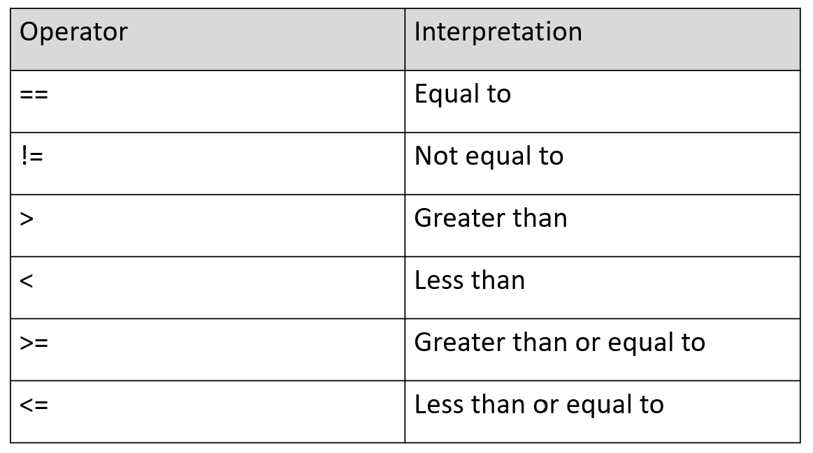
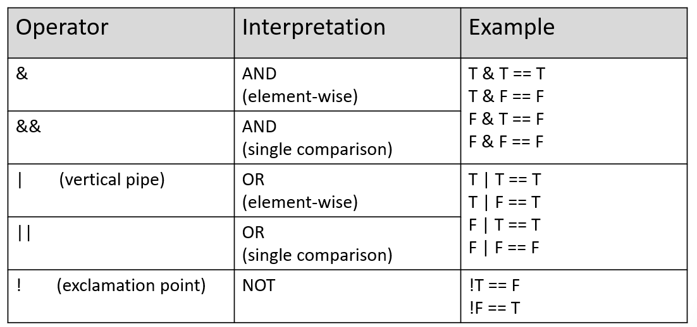
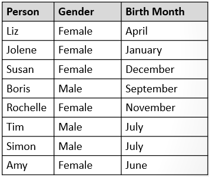
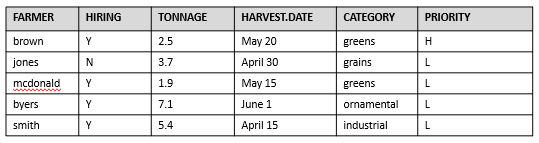

```{r rmarkdown-setup, echo = FALSE}
knitr::opts_chunk$set(warning = FALSE)
knitr::opts_chunk$set(message = FALSE)
```

## Module 3

## Extended Data Types and Data Structures

### Non-Numeric Values

- Logical values are TRUE and FALSE (or T and F)
  - Logical values can be assigned to objects such as vectors and matrices

```{r}
x <- T
x

y <- FALSE
y

v <- c(T,T,F,F)
v
```

### Relational Expressions

- Relational expressions produce logical values using relational operators



### Relational Operator Examples

```{r}
1 == 2
1 > 2
1 < 2
1 != 2

x <- 10
y <- 20
x == y
x < y
x > y
x != y
```

### Relational Operators with Vectors

- R does an element by element comparison when a relation operator is applied

```{r}
v1 <- c(1,2,3,4)
v2 <- c(2,2,3,4)
v1 == v2

v1 != v2

v1 < v2

v1 > v2
```

- Recycling works with relational operators

```{r}
v1 <- c(1,2,3,4)
v1

z <- c(2,3)
z

# compare 1,2,3,4 to (recycled) 2,3,2,3
v1 < z
```

### Relational Operators with Matrices

- Relational operators compare column-by-column

```{r}
m1 <- matrix(data=1:8,nrow=4)

m1
z1 <- c(2,3,4,5)
m1 < z1   # compare column by column to z1
```

### Logical Operators

- Logical operators are useful for combining multiple relational expressions

  - The result of any logical operator is a logical value of TRUE or FALSE
  - R is unique in that it provides both single comparison logical AND and OR operators and element-wise AND and OR operator



### Logical Operators: Long vs Short AND

- '&' is element-wise ("long")

```{r}
x1 <- c(T, F, T, F)
x2 <- c(T, T, T, T)
x1 & x2
```

- '&&' is single comparison, compares first vector elements **only** ("short")

```{r}
x1 && x2
x3 <- c(F, F, F, F)
x1 && x2 && x3
```

### Logical Operators: Long vs Short OR

- '|' is element-wise ("long")

```{r}
x1 <- c(T, F, T, F)
x2 <- c(T, T, T, T)
x1 | x2
```

- '||' is single comparison, compares first vector elements only ("short")

```{r}
x1 || x2
x3 <- c(F, F, F, F)
x1 || x2 || x3
```

### Logical Operators: NOT

- The logical NOT operator inverts the value of a logical expression

```{r}
x1 && x2 && x3
!(x1 && x2 && x3)
x1 || x2 || x3
!(x1 || x2 || x3)
```

### Logical Operators: Order of Precedence

- Logical AND operations have a higher precedence than OR
  - Use parentheses to change the order of evaluation

```{r}
v1 <- c(2,3)
v2 <- c(1,2)
v3 <- c(3,4)
(v1 < v2) & (v2 < v3)
(v2 < v3) | (v1 < v3)

# AND evaluates first by default
(v1 < v2) & (v2 < v3) | (v1 < v3)

# Relational comparisons (e.g. <) have higher precedence than
# logical operators, so parentheses aren't required here,
# but are useful for readability
v1 < v2 & v2 < v3 | v1 < v3

# modify so OR is evaluated first
(v1 < v2) & ((v2 < v3) | (v1 < v3))
```

### Logical values as numbers

- Logical values can be treated as numbers in R
  - TRUE is treated like the number 1
  - FALSE is treated like the number 0

```{r}
T+T        # 1 + 1
F+T+F+T    # 0 + 1 + 0 + 1
F+F        # 0 + 0
```

### Logical Subsetting

- "Logical flag vectors" allow the selection of elements from a vector based on the logical flag value

```{r}
v <- c(10, 20, 30, 40)
f <- c(F, T, F, T)

# extract elements which align
# with T in the flag vector f
v[f]
```

- Logical subsetting can be used to extract elements based on a logical (TRUE or FALSE) condition

```{r}
v <- c(10, 20, 30, 40)
# select all elements that are greater than 20
v[v > 20]

names <- c('David', 'Fred', 'Monica', 'Talia', 'Yolanda')
# alphabetic comparison
names[names > 'Monica']
```

- Logical subsetting can be used to selectively assign values

```{r}
v <- c(10, 20, 30, 40)
# change values that are greater than 20 to 100
v[v > 20] <- 100
v

names <- c('David', 'Fred', 'Monica', 'Talia', 'Yolanda')
# use long form of 'Fred'
names[names == 'Fred'] <- 'Frederick'
names
```

- The which() function identifies the index values of elements which correspond to TRUE

```{r}
f <- c(F, T, F, T)
which(f) # elements 2 and 4 are TRUE

v <- c(0, 20, 100, 100)
which(v < 100)  # elements 1 and 2 are less than 100
```

- Use which() to selectively remove values

```{r}
v <- c(0, 20, 100, 100)
# remove anything greater than 100
v[-which(v >= 100)]
```

- Logical subsetting also works with matrices

```{r}
m1 <- matrix(data=1:8,nrow=4)
m1
m1[m1 > 4] # find elements > 4
m1[m1 > 4] <- 20 # replace elements greater than 4 with 20
m1
```

## Character Strings in R

- Character strings represent any textual data, including letters, numbers, and punctuation symbols
- They are frequently used in R to redefine present **categorical** variables
- Strings in R are occasionally formatted as extended regular expressions
  - Regular expressions provide the ability for interesting string manipulations and also the opportunity to travel into a very deep rabbit hole (there are some very complex regular expressions)
- Strings are delimited by either double or single quotes, double is preferred
  - They are always displayed with double quotes

```{r}
s1 <- "Hello from Base R"
s1

s2 <- 'Hello from Base R'   # single quotes also work
s2
```

- Any value can be represented as a character string
  - Numeric operations cannot be performed in this form

```{r}
s1 <- "100"
s2 <- "200"
# s1 + s2   # uncomment and run to see the error
```

- String comparisons use standard relational operators
  - ==   for equals
  - !=    for not equals

```{r}
h1 <- "hello"
h2 <- "Hello"

h1 == h2

h1 != h2
```

- A major difference between R and other programming languages is that R's comparisons are locale-dependent, instead of doing numeric comparisons using ASCII or Unicode values
  - <, <=, >, >= will compare using a "collating order" (aka lexicographic)
  - "Comparison of strings in character vectors is lexicographic within the strings using the collating sequence of the locale in use: see locales. The collating sequence of locales such as en_US is normally different from C (which uses ASCII) and can be surprising. Beware of making any assumptions about the collation order…" 

  - <https://stat.ethz.ch/R-manual/R-devel/library/base/html/Comparison.html>

```{r}
# case difference, upper case wins. In other languages 
# which use ASCII/Unicode, this would be FALSE
"hello" < "Hello"
"Hallo" > "hello"  # case difference, but sequence has precedence
```

### Concatenation

- R provides two functions for concatenation: cat() and paste()
  - cat() sends results to the console and does not return any values
  - paste() returns the concatenated result
- both insert a space between

```{r}
s1 <- "100"
s2 <- "Hello from Base R"
v <- cat(s1,s2)
v
v <- paste(s1,s2)
v
```

### Escape Sequences

- The backslash is used to escape certain characters so they are interpreted as more than just simple symbols
  - \n  (newline) is a typical example which inserts a newline (CR/LF) character into the output

```{r}
cat("hello,", "world")
cat("hello,\n", "world")   # extra space between arguments
cat("hello,\nworld")       # no extra space
```

### More Escape Sequences


```{r}
s <- "\"tab \t BSyyy\b\""
cat(s)
```

### Substrings
- We can extract substrings from R strings
```{r}
foo <- "Hello, World"
bar <- substr(foo, start=7,stop=12)
bar

sc <- "Santa Claus"
eb <- "Easter Bunny"
paste(substr(sc, start=1, stop=5), 
        substr(eb, start=8, stop=12))
```

### Pattern Matching
- We can do pattern matching with R strings
  - Regular expressions are used for efficiency in specifying patterns

```{r}
# find one or more occurrences of the letter 'a'
# and return matching indexes
grep("a+", c("abc", "def", "cba a", "aa"), perl=T, value=F)


# find one or more occurrences of the letter 'a'
# and return matching values
grep("a+", c("abc", "def", "cba a", "aa"), perl=T, value=T)
```

### Factors
- Factors represent categorical data (data with a limited number of distinct values instead of a continuous range like numbers)
```{r}
firstname <- c("Liz", "Jolene", "Susan", 
                 "Boris", "Rochelle", "Tim", 
                 "Simon","Amy")
gender <- c("Female", "Female", "Female", 
              "Male",   "Female", "Male",
              "Male", "Female")
birthmonth <- c("April", "January", "December",        
                  "September", "November", "July", 
                  "July", "June")

typeof(gender)
```


### Creating Factors
- Creating vectors with character or numeric data by default retains those data type characteristics
```{r}
typeof(gender)
```

- To force a vector to take on the type of factor we can use the factor function:
```{r}
gender.f <- factor(gender)
gender.f

typeof(gender.f)
```

### Factors: Levels
- Levels represent the possible values factors can take
  - The levels() function extracts the levels from a vector of factors
```{r}
gender.f <- factor(gender)
gender.f

levels(gender.f)
```

### Factors: Relabeling Levels
- We can relabel levels
```{r}
# relabel as F/M instead of Female/Male
levels(x=gender.f) <- c("F","M")
levels(gender.f)

gender.f
```

### Factors: Subsetting
- Subsetting vectors using factors
```{r}
firstname <- c("Liz","Jolene","Susan", "Boris", 
                 "Rochelle","Tim","Simon", "Amy")

firstname[gender.f == "M"]  # find all males

firstname[gender.f != "M"]  # find all "not males"
```

### Defining and Ordering Levels
- We can apply logical ordering to factors so they can be compared in meaningful ways
- character string comparisons are alphabetical, but what if we want them compared based on their contextual values?

```{r}
weekdays <- c("Monday", "Tuesday", "Wednesday", 
                              "Thursday", "Friday")
weekdays[3] < weekdays[4]

# might want to interpret this differently, e.g. Wed < Thur
```

### Defining and Ordering Levels
- We can apply logical ordering to factors so they can be compared in meaningful ways

```{r}
weekdays.f <- factor(x=weekdays, 
                       levels=weekdays,
                       ordered=TRUE)
weekdays.f

weekdays.f[3] < weekdays.f[4]

```

### Defining and Ordering Levels
- We might want to provide all levels for a subset of data

```{r}
weekdays.f <- factor(
           x=weekdays,                 
           levels=c("Sunday","Monday","Tuesday","Wednesday",
                           "Thursday","Friday","Saturday"),
           ordered=TRUE)

weekdays.f  # 5 observations in 7 categories

```

### The cut() Function
- cut() divides a range into intervals and categorizes the values according to which interval they fall.
  - "breaks" specifies the intervals into which the values are categorized
  
```{r}
cut(c(0.5, 1.5, 2.5, 3.5),
      breaks=c(0,2,4))

```

### Combining and Cutting
- A square bracket [ or ] denotes inclusion for a range
- A parentheses ( or ) denotes exclusion for a range

  - (0,2]     # 0 is not included in the range, 2 is included
  - (0, 2)    # 0 is not included in the range, 2 is also not included
  - [0, 2)    # 0 is included in the range, 2 is not included
  - [0, 2]    # 0 is included in the range, 2 is also included


### Combining and Cutting
- Continuous data can be grouped, or binned, into discrete categories using the cut() function

```{r}
y <- c(0.53, 5.4, 1.5, 3.33, 0.45, 0.01, 2, 4.2, 1.99, 1.01)

y

by <- c(0, 2, 4, 6)

cut(y, breaks=by)


```

### Combining and Cutting
- Use right = F as an option to reverse the brackets/parentheses
  - This changes the grouping, some numbers will be in different bins

```{r}
y <- c(0.53, 5.4, 1.5, 3.33, 0.45, 0.01, 2, 4.2, 1.99, 1.01)
y


by <- c(0, 2, 4, 6)

cut(x = y, breaks = by, right = F)


```

### Combining and Cutting: Labeling Bins
- We can associate a name vector with the levels

```{r}
y

groups <- c("group1", "group2", "group3")

cut(x=y,breaks=by, right=F, labels=groups)

```

## Lists and Data Frames

### Lists of Objects
- The data structures covered so far only store one data type
- Lists allow multiple types
  - A list is like a vector of vectors
  - Lists group together any mix of R structures and objects
  - Use the list() function to create a list
```{r}
li <- list(v1, v2, m1, TRUE)

```

- The length() function returns the number of elements in the list

```{r}
length(li)

```

### Lists of Objects: Naming Elements
- We can name the elements in the list
  - This allows us to extract elements using $ notation
```{r}
m <- matrix(data=1:8,nrow=4)
li <- list(number=1001,logical=TRUE,matrix=m) # no quotes required!
li

li$logical  # extract using $element_name

li$matrix

```

### Lists of Objects: Renaming Elements
- Rename list elements using the names() function
```{r}
names(li) <- c("MyNumber", "MyLogical", "MyMatrix")

li

```

### Extracting List Elements Using [[ ]]
- Use double brackets to extract list elements:

```{r}
li[[1]]

```
- Single brackets also work, but there is a subtle difference in the return type
```{r}

li[1]
```
- Single brackets return a new list containing the element
```{r}
class(li[1])

```

- Double brackets return the actual element
```{r}

class(li[[1]])

```

### Nesting Lists
- A member of a list can also be a list
  - Managing nested lists can be complicated, have to remain mindful of nesting levels

```{r}
li <- list(number=1001,logical=TRUE,matrix=m) # no quotes required!

names(li) <- c("MyNumber", "MyLogical", "MyMatrix")

list2 <- list(point=c("x", "y", "z"), 
                pointval=c(3.79, 2.03, 5.6))
list2

li$p <- list2

li


```

### Extracting Nested List Elements
- Using $ notation:
```{r}
li$p

li$p$point       # vector

li$p$pointval    # vector

```

- Using [ ] notation:
```{r}

li[[4]]          # list

li[[4]][[1]]    # vector

li[[4]][[2]]    # vector

```

### Data Frames
- Data frames are two-dimensional lists of vectors
  - One of the most common forms of storage used in R
  - Grouped as a two-dimensional table, each vector is a column
  - Each vector must be of the same length (otherwise recycling occurs)
  - Each column can contain a different type of data, but within a column each data type is the same
- Use the data.frame() function to create a data frame
```{r}
cop1000_sections <- c(1212, 2043, 2193, 3012)
cop1000_faculty <- c("Smith", "Jones", "Harrison", "Ellison")
cop1000_students <- c(24, 26, 19, 23)
cop1000_mean_age <- c(24, 26, 24, 27)
cop1000 <- data.frame(cop1000_sections, cop1000_faculty,                        cop1000_students, cop1000_mean_age)

cop1000
```

- Extract using [] notation:
```{r}

cop1000[2]
```

### Data Frames: Strings as Factors
- String data in a data frame are interpreted as factors by default
  - Factors are categorical variables
  - Levels are possible values the factors can take
```{r}
cop1000_sections <- c(1212, 2043, 2193, 3012)
cop1000_faculty <- c("Smith", "Jones", "Harrison", "Ellison")
cop1000_students <- c(24, 26, 19, 23)
cop1000_mean_age <- c(24, 26, 24, 27)
cop1000 <- data.frame(cop1000_sections, cop1000_faculty,                        cop1000_students, cop1000_mean_age, stringsAsFactors = T)

print(cop1000[2,2])

print(cop1000[2,2], max.levels=0) # avoids display of Levels
```

### Data Frames: Column Names
- We can customize the column names in a data frame:
```{r}
names(cop1000) <- c("sections","faculty",
                      "num students", "mean age")
cop1000

```

### Adding Columns to a Data Frame Using $
- $ notation can be used to add a column to a data frame
```{r}
avgtotal <- c(79, 85,94,73)
# use $ notation to add as a column

cop1000$avgtotal <- avgtotal

cop1000


```

### Removing Columns from a Data Frame
- To remove a column from a data frame, use $ notation to set the column to NULL

```{r}
cop1000$avgtotal <- NULL
cop1000

```

### Adding Rows to a Data Frame
- Adding rows to a data frame using rbind() is more complex
  - The names for the new data must match the original

```{r}
# create temporary data frame with new data
newdata <- data.frame(2794,"Brown",31,23)

newdata

# sync the names
names(newdata) <- c("sections","faculty","num students", "mean age")
newdata

# bind the new row(s) using the temporary data frame
cop1000 <- rbind(cop1000,newdata)

cop1000
```

### Logical Record Subsets
- We can use logical flags to subset data frames

```{r}
# get logical vector for course sections > 20
# need " " for embedded spaces in column names
cop1000$"num students" > 20

cop1000[cop1000$"num students" > 20,]


```

### Sample Exercise
- Create a data frame using the table shown below which represents local farmers, their annual average harvest (in numeric tons), their average harvest date, and the category of crops they raise. Follow these steps to create the data frame.
  - Use the data.frame function to create the data frame with the FARMER, TONNAGE, HARVEST.DATE, and CATEGORY columns only. CATEGORY factor levels are: "greens", "grains", "fiber", "ornamental","feed","industrial".
  - Add a column indicating each farmer's hiring status as Y or N.
  - Reorder the columns, moving the hiring status to column 2.
  - Add an observation for the farmer "smith" who raises industrial crops, is hiring, producing an average of 5.4 harvested tons, with an   - April 15 harvest date.
  - Create a factor vector of priorities with values H (for High) and L (Low).
  - Create a PRIORITY vector using the factor vector just created which indicates a high priority supplemental funding status for farmers producing greens with an average harvest of more than 2 tons. Append this data as a column to the data frame.



```{r}
# farmdata.R
# D. Singletary
# WinterWorkingConnections2022
# creates farm data data frame
farm.data <- data.frame(
    FARMERS=c("brown", "jones", "mcdonald", "byers"),
    TONNAGE=c(2.5, 3.7, 1.9, 7.1),
    HARVEST.DATE=c("May 20", "April 30", "May 15", "June 1"),
    CATEGORY=factor(c("greens","grains", "greens", "ornamental"),
      levels=c("greens","grains","fiber","ornamental","feed","industrial")),
    stringsAsFactors=F)
str(farm.data)

# change TONNAGE to numeric from chr if necessary
# farm.data$TONNAGE <- as.numeric(farm.data$TONNAGE)

farm.data$HIRING <- factor(c("Y","N","Y","Y"))

# move column 5 to column 2
farm.data <- farm.data[,c(1,5,2,3,4)]

# add a row
farm.data <- rbind(farm.data, c("smith", "Y", 5.4, "April 15", "industrial"))

# add priorities
prio_vals <- c("L", "H")
PRIORITY <- prio_vals[(farm.data$TONNAGE > 2.0 & farm.data$CATEGORY == "greens") + 1]
PRIORITY
farm.data$PRIORITY <- PRIORITY
farm.data
```

