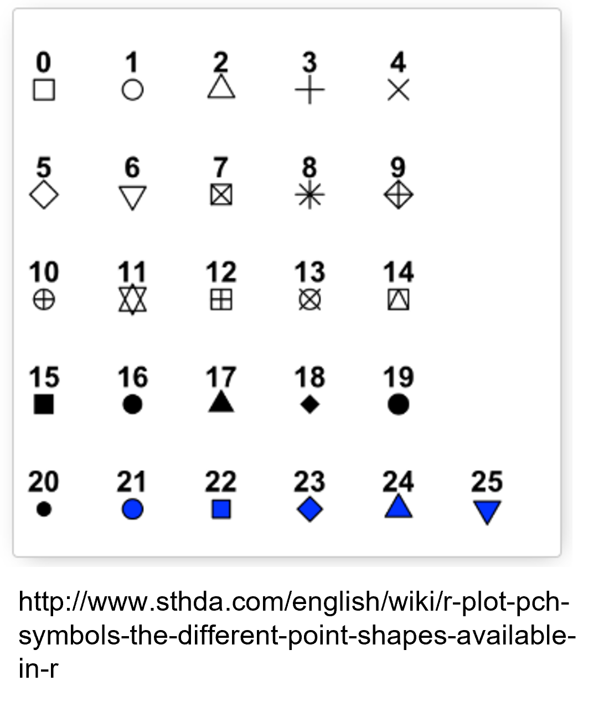

```{r rmarkdown-setup, echo = FALSE}
knitr::opts_chunk$set(warning = FALSE)
knitr::opts_chunk$set(message = FALSE)
```

## Module 4

## Special Values and Coercion

### Special Values

- Many scenarios in R, and data science in general, call for special values
  - missing data
  - incorrect data
  - corrupt data
- Special values include
  - Infinity: Inf is reserved for numbers too large to represent in R
  - NaN ("not a number"): invalid numerical values, e.g. 0 / 0
  - NA ("not available"): missing or invalid values (all types)
  - NULL: an empty entity (vs. not available)

### Infinity (Inf)
- The Inf keyword is case-sensitive
- Positive and negative (-Inf) values supported
- Actual value varies based on platform / available memory
- Inf can be used in arithmetic operations

```{r}

9000^100

9000^100 * -1

Inf + 1

Inf - 10000

20000 / Inf

Inf / 50

```

### Testing for Special Values
- is.finite() and is.infinite() will test for finite/infinite values in vectors and matrices (but does not work with lists or data frames)

```{r}
x1 <- c(10, Inf, -50, -Inf, 9000^100)
is.finite(x1)
is.infinite(x1)

m <- matrix(c(1,2,3,NA,5,6,NaN,8,Inf),nrow=3)
is.infinite(m)

df <- data.frame(col1=c(7,8,9),col2=c(10,11,Inf))
#is.infinite(df) #will generate an error

```

### Testing for Special Values
- is.na() and is.nan() will test for NA and NaN, respectively, although is.na will also include NaN values
- is.na works with lists and data frames, is.nan does not
```{r}
x1 <- c(10, NA, -50, NaN, 9000^100)
is.na(x1)

is.nan(x1)


df <- data.frame(col1=c(7,8,NaN),col2=c(10,11,NA))
is.na(df)

#is.nan(df) #will generate an error

```

### Object Attributes
- Objects created in R can possess self-referential information known as attributes
  - e.g. dimensions, levels, names
- The attributes() function displays the attributes of an object

```{r}
m <- matrix(
      c('hello','world',
        'goodbye','charlotte'),
      nrow= 2,ncol=2,
      byrow=TRUE)

m

attributes(m)
```

- If you know the name of an attribute, you can also extract it with the attr() function

```{r}

dfm <- data.frame(
        word1=c('hello','goodbye'),
        word2=c('world','charlotte'))

dfm

attributes(dfm)

attr(x=dfm,which='names')
```

### Unspecified Attributes
- Attributes vary by object type
- Some attributes are NULL if not specified

```{r}
m <- matrix(c('hello','world','goodbye','charlotte'),
              nrow= 2,ncol=2,byrow=TRUE)

attributes(m)

attr(x=m,which='dimnames')

```

### Setting Attributes
- Attributes can be set by name when an object is created

```{r}
m <- matrix(
     c('hello','world','goodbye','charlotte'),
     nrow=2,ncol=2,byrow=TRUE,
     dimnames=list(c('phrase1','phrase2'),
                   c('word1','word2')))

m

attributes(m)


```

### Creating Attributes
- New attributes can be created using the attr() function

```{r}
attr(m, "values") <- c("letters", "numbers")
attributes(m)

```

### Object Class
- R is an object-oriented language
  - Each object has at least one class attribute used to describe it
- The class() function will report the class attribute value
  - For vectors (only), class() reports the type of data stored

```{r}
v <- c("hello", "world")
v
class(v)


m2 <- matrix(1:9, nrow=3 )
dimnames(m2) <- list(c("A", "B","C"), c( "D", "E", "F"))
m2

class(m2)

dfm

class(dfm)

```
### The S3 System
- S3 refers to a class system built into R. The system governs how R handles objects of different classes
  - Certain R functions will look up an object’s S3 class, and then behave differently in response. When you print a numeric vector, print will display a number:

```{r}
num <- 1000000000
print(num) #scientific notation

```
- But if you apply the S3 classes POSIXct and POSIXt to num, print will now  display a time:
```{r}
class(num) <- c("POSIXct", "POSIXt")
print(num)

```
- R’s S4 system is similar to S3 but uses a more formal set of rules (not within the scope of this course)

### Type-Checking Functions
- is-dot functions identify the class or data type of an object
```{r}
num.vec <- 1:4
is.integer(num.vec)
is.numeric(num.vec)
is.matrix(num.vec)
is.data.frame(num.vec)
is.vector(num.vec)
is.logical(num.vec)

```
### Coercion Functions
- _Coercion_ functions allow conversion from one object or data type to another
- **Implicit** coercion occurs automatically when elements need to be converted to another type in order for an operation to complete, e.g. using numeric values for logical values (one for TRUE, 0 for FALSE)
  -Implicit coercion occurs in the following statement:
```{r}
1:4 + c(T, F, F, T)
```
- **Explicit** coercion is performed by applying as-dot functions

```{r}
as.numeric(c(T, F, F, T))
```
- Coercions are possible in cases where the conversion "makes sense"
```{r}
as.numeric("32.4")
```
- R warns when it doesn't like a coercion
```{r}
as.numeric("g'day mate")

```
### Chaining Coercion Functions
- Some coercions require multiple steps

```{r}
as.logical(as.numeric(c("1", "0", "1", "0","0")))
```
- Levels of factors are assigned numeric values internally (alphabetically by default); this can be demonstrated by converting them to a numeric type

```{r}
xfactor <- factor(x=c("plum", "pear", "plum", "plum", "apple", "apple", "plum"))
xfactor
as.numeric(xfactor)
```
### Coercing Higher Level Objects: Failure
- Consistent characteristics (e.g. length) are required to coerce higher level objects
```{r}
foo <- matrix(c(1,2,3,4),ncol=2)
baz <- list(var1=foo,var2=c(T,F,T),var3=factor(x=c(2,3,4,4,2)))
baz


#as.data.frame(baz)  #list variables have varied lengths ERROR

```
### Coercing Higher Level Objects: Success
- If all elements have the same length, the coercion works
```{r}
foo <- list(var1=c(3,4,5,1), var2=c(T,F,T,T), var3=factor(x=c(4,4,2,1)))
foo
as.data.frame(foo)

```
## Basic Plotting
### How to Build a Plot
####  "When creating a plot we start with data."
##### Wickham, Hadley: **A Layered Grammar of Graphics**

### The plot() Function
- The plot() function takes a vector of x values and a vector of y values as parameters
  - Length of both vectors must be the same
  - If only one vector is provided, a sequential index serves as the x-axis
```{r}
plot(x=c(1,2,3,4,5), y=c(2,4,6,8,10))

```


### The plot() Function
- plot() also takes a matrix (and other structures, e.g. data frames) as a parameter

```{r}
m <- matrix(c(1.0, 2.0, 3.0, 4.0, 5.0, 2.7, 3.9, 3.1, 4.5, 4.1),
              ncol=2,dimnames=list(NULL,c('x','y')))
m

plot(m)

```


### Graphical Parameters
- Graphical parameters can be added to the plot command for visual enhancement


### Automatic Plot Types
- By default, plot() plots individual data points
- Varying the *type* argument produces different plot types

```{r}
m
plot(m,type="l") # line plot (lower case L)

```


### Title and Axis Labels
- main, xlab, ylab options are used to add a title and axis labels

```{r}
# type 'b' is line and point
plot(m,type='b', main="XY Coordinates", 
     xlab="X Axis", ylab="Y Axis")

```

### Color
- Color can be added to plots using various methods, one of which is a character string
  - colors() will display the available color string representations
```{r}
colors()

```

### Adding Color With a Character String
type 'o' is "overplot" to avoid gaps between points and lines
```{r}
plot(m,type="o", col='forestgreen',
       main="XY Coordinates", xlab="X Axis", ylab="Y Axis")

```


### Line and Point Appearances
- **Ity** modifies line types
- one of a range between 0 and 6


- The pch argument modifies point types
- Point types can be a specific character (e.g. 'p' or '!') or one of a range of predefined numbered symbols between 0 and 25




### Using cex to Change Point Size
- The value of the cex argument indicates the scaling factor for text and symbols relative to the default value of 1.
  - e.g. 1.5 is 50% larger, 0.5 is 50% smaller, etc.
- Following example also demonstrates numeric color values

```{r}
plot(c(1,2,3,4,5,6,7,8),pch=19,cex=2,col=c(1,2,3,4,5,6,7,8))
```


### Plot Region Limits
- Extra space is sometimes needed to annotate plots or add additional components
  - xlim and ylim provide custom plot area limits
  - both require a vector of length 2 as c(lower, upper)

```{r}
plot(m,type="o", col='forestgreen',
       main="XY Coordinates", xlab="X Axis", ylab="Y Axis")

plot(m,type="o", col='forestgreen', 
   main="XY Coordinates With Region",
   xlab="X Axis", ylab="Y Axis", xlim=c(0,6), ylim=c(0,6))

```


### Adding Points, Lines, and Text
- By default, plot() will reset the plot device
- Plot components can be added progressively using the following functions:
  - points() – add points
  - lines() – add lines using coordinates
  - abline() – add straight lines 
  - segments() – add line segments between points
  - text() – add text components
  - arrows() – add arrows between pairs of points
  - legend() – add a plot legend


### Adding Points
```{r}
plot(m,type="o", col='forestgreen',main="XY Coordinates",
       xlab="X Axis", ylab="Y Axis")
points(pch='w',c(1.5, 2.0, 2.5, 3.0, 3.5, 4.0, 4.5),
         c(3.0, 3.125, 3.25, 3.375, 4.0, 4.125, 4.5),
         col='darkviolet')

```


### Adding Lines
```{r}
plot(m,type="o", col='forestgreen',
       main="XY Coordinates", xlab="X Axis", ylab="Y Axis")
lines(c(1.5, 2.0, 2.5, 3.0, 3.5, 4.0, 4.5),
        c(3.0, 3.125, 3.25, 3.375, 4.0, 4.125, 4.5),
        col='darkviolet')

```

