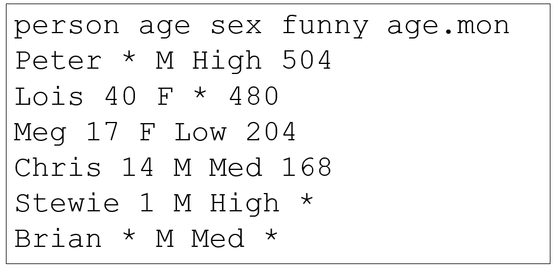

```{r rmarkdown-setup, echo = FALSE}
knitr::opts_chunk$set(warning = FALSE)
knitr::opts_chunk$set(message = FALSE)
```

## Module 5

## Input, Output, and Functions

### Bundled Datasets

- data() displays data bundled with the R distribution

```{r}
data()
```

### Viewing Dataset Information

- ?dataset will display information about or a particular dataset

```{r}
?CO2
```

- Bundled data can be extracted using the same tools and methods used for analysis in previous modules

```{r}
??Chickweight    # ?? does a more in-depth search than ?
ChickWeight[1:15,]
```

- File Input and Output

- R provides many functions to read and write file data
  - Table-format data is structured as plain-text files
  - formatting options required when processing:
    - a header row (optional), used for column names
    - a delimiter, used to separate data items in each row
    - missing value character(s), used in place of missing data items
- Typical file extension is .txt (text) or .csv (comma-separated values)

- The file mydatafile.txt contains the following data, including a header row, single-space delimiter, and '*' characters for missing data



- read.table() reads a text file in as a data frame
  - Use stringsAsFactors=T to convert strings to factors
    (default of TRUE was deprecated in Rv4)
  - Use skip=n to skip n lines before beginning to read
  - getwd() gets current working folder
  - setwd() sets current working folder
  - list.files() lists files in folder
  
```{r}
# this code needs tweaking to execute, depending on the location of the ifle
#fileName = "mydatafile.txt"
# here is the URL of the file for download
# fileURL = "https:///github.com/ProfSingletary/WWC2022/blob/main/workbooks/day2/mydatafile.txt"
#datafile <- read.table(fileName,
#                       header=T, sep=' ', 
#                       na.string='*')
#datafile

getwd()
#setwd()
#list.files()
```

### Converting Strings to Factors

```{r}
# create the dataframe if file cannot be read
person <- c('Peter', 'Lois', 'Meg', 'Chris', 'Stewie', 'Brian')
age <- c(NA, 40, 17, 14, 1, NA)
sex <- c('M', 'F', 'F', 'M', 'M', 'M')
funny <- c('High', NA, 'Low', 'Med', 'High', 'Med')
age.mon <- c(504, 480, 204, 168, NA, NA)
mydatafile <- data.frame(person, age, sex, funny, age.mon)
mydatafile
```

- as.factor() can be used to convert character strings read from files

```{r}
str(mydatafile$sex)
mydatafile$sex <- as.factor(mydatafile$sex)

str(mydatafile$sex)
mydatafile$funny <- factor(x=mydatafile$funny, 
                          levels=c("Low","Med","High"))
str(mydatafile$funny)
```

### Writing Text Files

- write.table() and write.csv() write data to files
  - Can specify whether to enclose non-numeric entries in quotes
  - Can specify whether to include row names

```{r}
#
write.table(x=mydatafile,file='mydatafile-new.txt',
            sep=',',na='NNN',quote=F,row.names=F)
```

- mydatafile-new.txt file now contains

  - person,age,sex,funny,age.mon
  - Peter,NNN,M,High,504
  - Lois,40,F,NNN,480
  - Meg,17,F,Low,204
  - Chris,14,M,Med,168
  - Stewie,1,M,High,NNN
  - Brian,NNN,M,Med,NNN

## Calling Functions

### Reserved Names

- Some reserved names exist in R and cannot be used to name objects or functions
  - if / else
  - for / while / in
  - function
  - repeat / break / next
  - TRUE / FALSE
  - Inf / -Inf
  - NA, NaN, NULL

- It is not a good practice to use mixed case to bypass the reserved name restrictions:

  - False <- TRUE   # this is very confusing
  - nan <- "not"

- The same guidance applies to abbreviations, which are not reserved:

  - T <- 42         # allowed, but confusing
  - F <- TRUE

### Argument Matching

- There are various ways to match arguments when calling functions
- Exact argument matching: explicit specification of argument tags
  - e.g. 'dimnames'
  - cumbersome for simple operations, but avoids ordering or skipping issues

```{r}
bar <- matrix(data=1:9, nrow=3, ncol=3, 
              dimnames=list(c("A","B","C"),c("D","E","F")))
```

- Partial matching allows matching of arguments with an abbreviated tag
  - Also supports reordering

```{r}
bar <- matrix(dat=1:9, nr=3, nc=3, 
              di=list(c("A","B", "C"),c("D","E","F")))
```

- Positional matching allows untagged arguments
  - Ordering must be preserved
  - Use args() function to verify usage

```{r}
bar <- matrix(1:9, 3, 3, F,   # byrow argument required for all positional
              list(c("A","B", "C"),c("D","E","F")))
```

- Mixed matching
  - matching types can be combined
  - e.g. start with positional, then use partial

```{r}
bar <- matrix(1:9, 3, 3, # byrow not required here since dimnames specified
              dim=list(c("A","B", "C"),c("D","E","F")))
```

### Variadic (varargs)

- **Variadic** functions accept variable numbers of arguments
  - Ellipses  …   support this feature in R 
  - FYI **ellipses** is plural, **ellipsis** is singular
  - Any arguments not matched to tags provided are matched to the ellipsis
  - Frequently used to pass secondary objects to sub-functions called within another function

```{r} 
args(data.frame)
```
