```{r rmarkdown-setup, echo = FALSE}
knitr::opts_chunk$set(warning = FALSE)
knitr::opts_chunk$set(message = FALSE)
```

## Module 6

### Conditions and Loops

- The **if** statement allows for conditional execution of code

```{r}
a <- 3
myNumber <- 4
if (a <= myNumber) {   # end of line brace style
         a <- a^2
         print('modifying a')
}

if (a <= myNumber) 
{   # next line brace style
         a <- a^2
         print('modifying a')
}
```

-- end of line or next line brace style is acceptable but be consistent

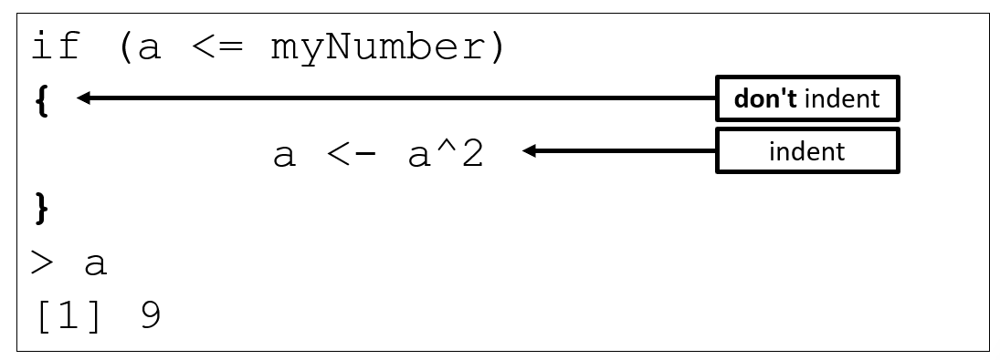

- For a single-line if statement body, braces are not required, but it doesn't hurt to use them anyway
  - Using them can prevent subsequent defects when code is added to the body later
  
```{r}
a <- 3
myNumber <- 4
if (a <= myNumber) # this works
     a <- a^2

if (a <= myNumber) { # but this is recommended
     a <- a^2
}
```

- Conditions in if statements may be relational or logical expressions

```{r}
myvec <- c(2.73, 5.40, 2.15, 5.29, 1.36, 2.16, 1.41, 6.97, 7.99, 9.52)
mymatrix <- matrix(c(2,0,1,2,3,0,3,0,1,1), nrow=5, ncol=2)
myvec
mymatrix

if (any((myvec - 1) > 9) || matrix(myvec, 2, 5)[2,1] <= 6) {
    new.myvec <- myvec
    new.myvec[seq(1,9,2)] <- NA
    mylist <- list(aa=new.myvec, bb=mymatrix + 0.05)
    cat("new list:\n")
    mylist
}
```

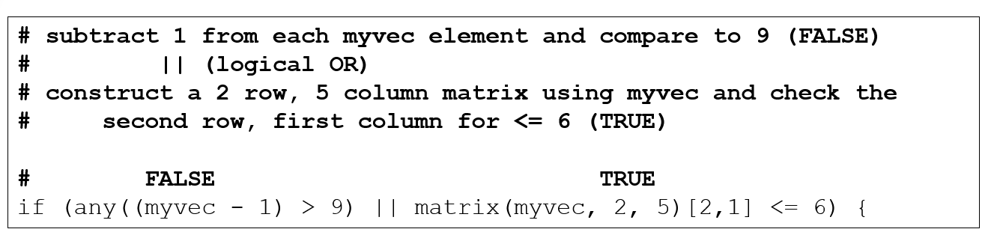

- Else statements provide an alternative path for code to follow if an if condition is FALSE

- if (condition) {
-     # statements executed if condition is true
- } else {
-     # statements executed if condition is false
- }

```{r}
a <- 5
myNumber <- 4
if (a <= myNumber) {
      a <- a^2
} else {
      a <- a - 3.5
}
a
```

### Limitations of if in R

- An if statement can check the condition of only **a single logical value**.
  - If you pass in a vector of logicals for the condition, the if statement will only check the very first element and a warning is displayed, e.g.

```{r}
if (c(FALSE,TRUE,FALSE,TRUE,TRUE))  { }
```

- displays
  - Warning message:
  - In if (c(FALSE, TRUE, FALSE, TRUE, TRUE)) { :
  - the condition has length > 1 and only the first element will be used
  
### ifelse for Logical Vectors

- **Description**
- ifelse returns a value with the same shape as test which is filled with elements selected from either yes or no depending on whether the element of test is TRUE or FALSE.
- **Usage**
- ifelse(test, yes, no)
- **Arguments**
- test	
  - an object which can be coerced to a logical value
- yes	
  - return values for true elements of test.
- no	
  - return values for false elements of test.

```{r}
x <- 5
y <- -5:5
y
result <- ifelse(test= y == 0, yes = NA, no = x)
result
```

- An if statement can be placed within another if statement

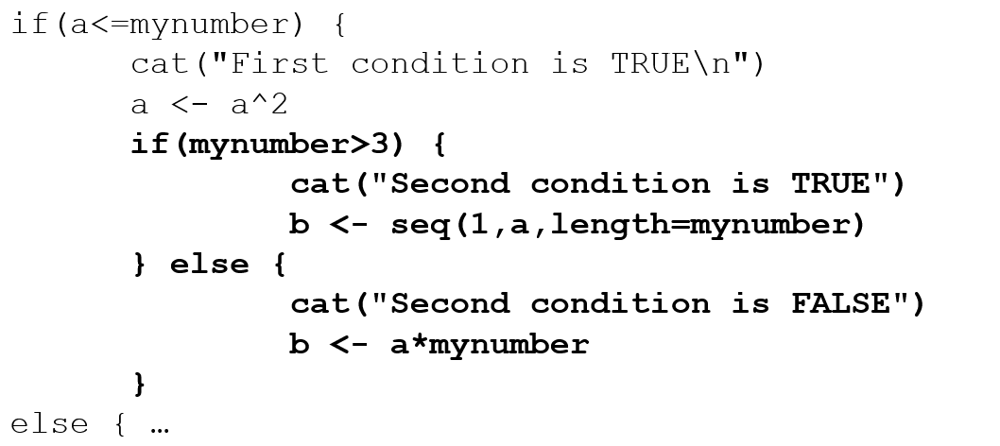

- If statements can be sequentially stacked

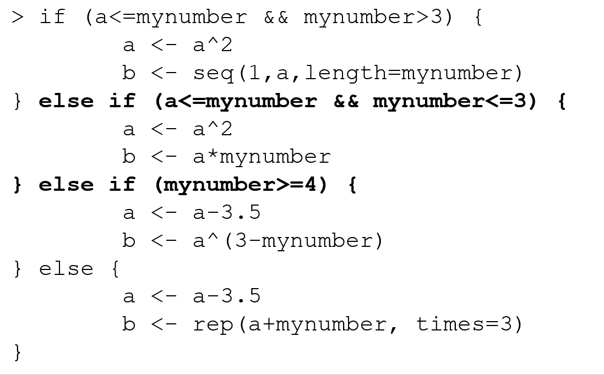

### The Switch Statement

- switch() provides an alternative to complex stacked sequences

```{r}
mystring="Bart"

foo <- switch(EXPR=mystring, 
           Homer=12,
           Marge=34,
           Bart=56,
           Lisa=78,
           Maggie=90,
           NA
         )
foo

# is equivalent to

if(mystring=="Homer") {
      foo <- 12
} else if(mystring=="Marge") {
      foo <- 34
} else if(mystring=="Bart") {
      foo <- 56
} else if(mystring=="Lisa") {
      foo <- 78
} else if(mystring=="Maggie") {
      foo <- 90
} else {
      foo <- NA
}
foo
```

### For Loops

- The for loop iterates through elements in an object

```{r}
for(myitem in 5:7) {
  cat("the current item is",myitem,"\n")
}
```

- Vector elements in a for loop can be accessed by a variable named in the loop header or by an index

```{r}
# the following examples are equivalent:
myvec <- c(0.4,1.1,0.34,0.55)
for(i in myvec) {
    print(2 * i)
}

for(i in 1:length(myvec)) {
    print(2 * myvec[i])
}
```

- Preallocating output objects makes loop processing much more efficient
  - Time the following operations and compare their performance

```{r}
system.time({
  output <- rep(NA, 10000000);  # preallocate output object
  for (i in 1:10000000) {
    output[i] <- i + 1
  }
})

system.time({
  output <- NA;                 # dynamically resize output object
  for (i in 1:10000000) {
    output[i] <- i + 1
  }
})
```

- For loops can be nested
  - Align/indent for readability
  - Variable used in header must be unique

```{r}
loopvec1 <- c(1, 2, 3)
loopvec2 <- c(5, 10, 15)
result <- NULL
count <- 1
for (i in 1:length(loopvec1)) {
    for (j in 1:length(loopvec2)) {
        result[count] <- loopvec1[i]*loopvec2[j]
        count <- count + 1
    }
}
result
```

### While and Repeat Loops

- The while loop runs code while a certain condition remains TRUE

  - while (condition) {
    - code
  - }
  
```{r}
i <- 1
while (i < 6) {
  print(i)
  i <- i + 1
}
```

- The repeat loop will run code until the Escape key is pressed or the code encounters a break command

  - repeat {
    - code
    - if (condition) {
      - break
    - }
  - }

```{r}
x <- 1
# Repeat loop
repeat {
    print(x)
    
    # break statement to terminate if x > 4
    # comment out for infinite version, 
    # <Esc> required to terminate
    if (x > 4) {
        break
    } 
    
    # Increment x by 1
    x <- x + 1
}
```

- Any number of loops can be nested
  - The computational cost can become a problem if done unwisely
  - Many loops can also be replaced by vector operations

  - The following function uses a loop that is not vectorized, the loop  manipulates each element of the vector one at a time

```{r}
abs_loop <- function(vec) {   # create a function to set abs value
    for (i in 1:length(vec)) {
        if (vec[i] < 0) {
            vec[i] <- -vec[i]
        }
    }
    vec
}
#abs_loop(-10000:-1)   # uncomment to call the function
```

- abs_vec (below) is vectorized
  - It uses logical subsetting to manipulate every negative number in the vector at the same time
  - This is much faster than abs_loop because it relies on operations that R does quickly: logical tests, subsetting, and element-wise execution

```{r}
abs_vec <- function(vec) {  # create a function to set abs value
    negs <- vec < 0
    vec[negs] <- vec[negs] * -1
    vec
}
#abs_vec(-10000:-1)   # uncomment to call the function
```

- You can use R’s <- assignment operator, which is also vectorized, to save a new set of values over an old set

```{r}
vec <- c(1, -2, 3, -4, 5, -6, 7, -8, 9, -10)
vec
vec[vec <  0] <- vec[vec < 0] * -1
vec
```

### Loop Guidelines

- If you can avoid loops using vectorization, you should do so
  - A good way to spot loops that could be vectorized is to look for combinations of if and a loop
  - if can only be applied to one value at a time
  - This combination can usually be replaced with logical subsetting, which will do the same thing but run much faster
  - There are operations that cannot be vectorized and require loops
- You can dramatically increase the speed of your loops by:
  - doing as much as you can outside of the loop
  - making sure that any storage objects that you use with the loop are preallocated

### Implicit Looping with Apply()

- In some situations, especially for relatively routine loops (such as executing some function on each member of a list), you can avoid some of the details associated with explicit looping by using the apply function
- The apply function is the most basic form of implicit looping; it takes a function and applies it to each margin (see below) of a data structure

  - MARGIN = 1 function is applied over rows
  - MARGIN = 2 function is applied over columns

```{r}
foo <- matrix(1:12,4,3)
foo
# find the sum using a for loop (by rows)
row.totals.looprow <- rep(NA,times=nrow(foo))
for(i in 1:nrow(foo)) {
    row.totals.looprow[i] <- sum(foo[i,])
}
row.totals.looprow

# find the sum using a for loop (by columns)
row.totals.loopcol <- rep(NA,times=ncol(foo))
for(i in 1:ncol(foo)) {
    row.totals.loopcol[i] <- sum(foo[,i])
}
row.totals.loopcol

# find the sum using apply
# by rows
row.totals.row <- apply(X=foo, MARGIN=1, FUN=sum)
row.totals.row

# by columns
row.totals.col <- apply(X=foo, MARGIN=2, FUN=sum)
row.totals.col
```

### Apply Variations

- There are different flavors of the basic apply function
  - The tapply function performs operations on subsets of the object of interest, where those subsets are defined in terms of one or more factor vectors
  - lapply operates member by member on a list
  - sapply returns the same results as lapply but in an array form
  - All apply functions allow for additional arguments to be passed to FUN; most via an ellipsis

### Writing Functions

- Functions have 3 parts: an argument list (i.e. the "formals"), a body, and an environment
  - Functions in R are objects, just as vectors and data frames are objects
  - This property is often referred to as "first-class functions"

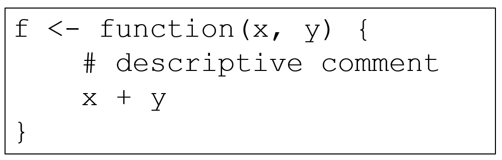

- Functions are defined using the function() function (really!)

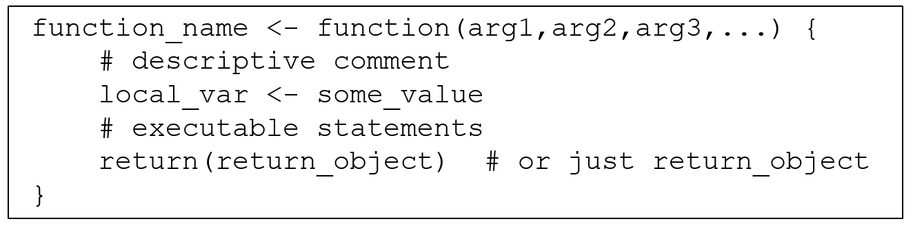

- Arguments, tags, and the use of ellipsis depend on the function being defined
  - If the function does not require any arguments, use empty parentheses ( )
  - variables created in a function are local to that function
  - explicit return statements are usually not required

### To Return … or Not to Return

- The last expression evaluated in a function becomes the return value, the result of invoking the function.

```{r}
f <- function(x) {
    if (x < 10) {
        0
    } else {
        10
    }
}

f(5)
f(15)
```

- "Generally, I think it’s good style to reserve the use of an explicit return() for when you are returning early, such as for an error, or a simple case of the function. This style of programming can also reduce the level of indentation, and generally make functions easier to understand because you can reason about them locally."

- Hadley Wickham, "Advanced R", http://adv-r.had.co.nz/Functions.html

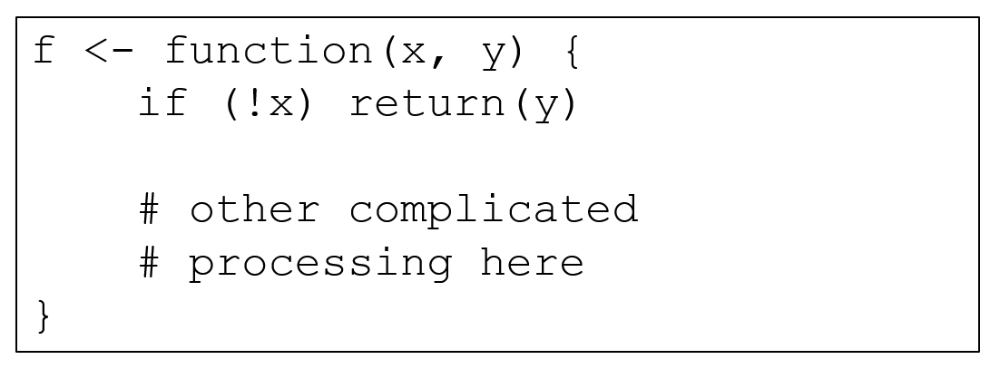

### Managing Custom Functions

- Use save() to store custom functions as R-encoded binary files on the disk.
- Use load() to read files and load custom functions into R

  - save(my_function, file = 'My Functions.R') 
  - load('My Functions.R') 

- Use dump() to write custom functions to the disk as plain text

  - dump(c('my_function'), file = 'My Functions.R')

- Use source() to read a text file from the disk and execute it as if it were typed from a console

  - source(file = 'My Functions.R') 

### R Packages

- The fundamental unit of shareable code in R is the package. 
  - A package bundles together code, data, documentation, and tests, and is easy to share with others.
  - When you load a package, R checks whether any objects in the package clash with other objects that are accessible in the present session

```{r}
#install.packages("spatstat")
#library("spatstat")
#install.packages("car")
#library("car")
```

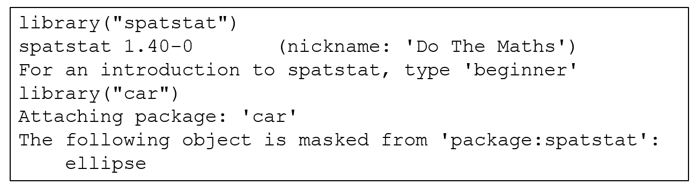

- This warning indicates that the two packages each have an object with the same name of "ellipse".
  - R notifies you that the object masked (aka shadowed"), use package::object to access it
  
### Creating Custom Packages

- Building packages involves taking a source directory and creating a "tarball" ready for distribution, including cleaning it up and creating PDF documentation from any vignettes 
  - A vignette (pronounced "vinyet") is a descriptive guide to the package
- The sources of an R package consist of a subfolder containing files named DESCRIPTION and NAMESPACE, and the subfolders R, data, demo, exec, inst, man, po, src, tests, tools and vignettes.
  - These subfolders may be omitted; if included they should not be empty. 
  - The package subfolder may also contain files named INDEX, configure, cleanup, LICENSE, LICENCE and NEWS. 
  - Other files such as INSTALL (for non-standard installation instructions), README/README.md2, or ChangeLog will be ignored by R, but may be useful to end users. 

<https://cran.r-project.org/doc/manuals/R-exts.html#Creating-R-packages>

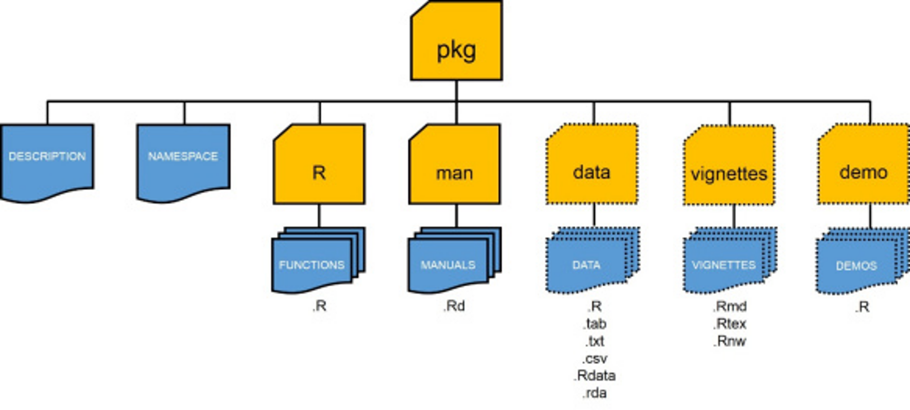

- The DESCRIPTION file contains basic information about the package in the following format:


### Licensing

- Licensing for a package which might be distributed is an important but potentially complex subject.
  - It is very important that you include license information! Otherwise, it may not even be legally correct for others to distribute copies of the package, let alone use it.
- The package management tools use the concept of ‘free or open source software’ (FOSS) licenses: the idea being that some users of R and its packages want to restrict themselves to such software. Others need to ensure that there are no restrictions stopping them using a package, e.g. forbidding commercial or military use. 
  - It is a central tenet of FOSS software that there are no restrictions on users nor usage.
  - Do not use the ‘License’ field for information on copyright holders: if needed, use a ‘Copyright’ field.

### Step-by-Step

1. Download supplemental packages
2. Create package directory
3. Add functions
4. Add documentation
5. Process documentation
6. Install and Test

- Unloading a Package
  - detach("package:pkgname", unload=TRUE)

### Debugging, Exceptions, and Timing

- Debugging tools are built in to R
- Indications:
  - message: A generic notification/diagnostic message produced by the message function; execution of the code continues. Not necessarily a problem. 
  - warning: An indication that something unexpected happened but not necessarily fatal; execution of the code continues; generated by the warning function 
  - error: An indication that a fatal problem has occurred; code execution stops; produced by the stop function 
  - condition: A generic concept for indicating that something unexpected can occur; programmers can create their own conditions

### Warnings and Errors

- R provides warnings and errors to indicate problems
  - Warnings allow execution to continue
  - Warnings are invoked by the warning() function

```{r}
warn_test <- function(x) {
    if (x <= 0) {
        warning("x is 0 or negative, setting to 1")
        x <- 1
    }
    return(5/x)
}

warn_test(-1)
```

- Errors cause immediate termination of the function
  - Errors are invoked by the stop() function

```{r}
error_test <- function(x) {
    if (x <= 0) {
        #stop("x is 0 or negative, TERMINATED!") # uncomment to test stop function
        x <- 1
    }
    return(5/x)
}

error_test(0)
```

### Diagnosing Problems

- Questions to ask:
  - What was your input? 
  - How did you call the code? 
  - What were you expecting? 
  - Output, messages, other results? 
  - What did you get? 
  - How does what you get differ from what you were expecting? 
  - Were your expectations correct in the first place? 
  - Can you reproduce the problem? 

### Debugging Tools

- traceback: prints stack trace if error occurs, nothing otherwise
- debug: flags a function for debugging, allows step-through of code
- browser: suspends execution of a function and puts it in debug mode
- trace: insert debugging code in specific places. Useful when you don't have the source code.
- there's always print & cat

<https://adv-r.hadley.nz/debugging.html>

- traceback() can be used to print a summary of how your program arrived at an error. 
  - This is also called a call stack, stack trace or backtrace. 
  - In R this displays each function call and associated argument(s) that lead up to the error, which can be very useful for determining what lead to the error

```{r}
mean(x)
traceback()
```

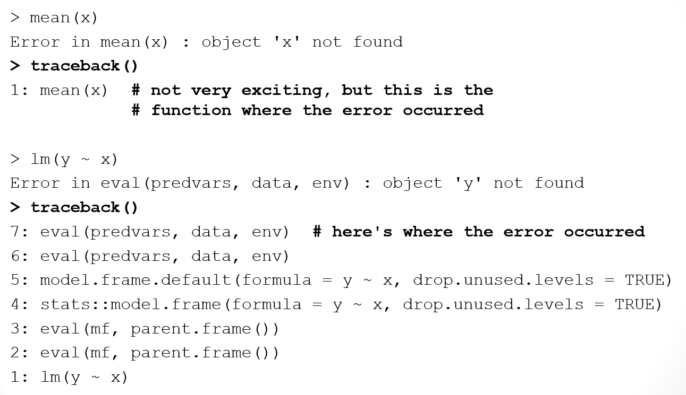

- debug() allows the user to step through the execution of a function, line by line. 
  - Values of variables or graphs of the results within the function can be displayed at any time.
  - Type “c” to continue to the end of the current section of code
  - To start debugging: debug(function_name)
  - To stop debugging: undebug(function_name)
  
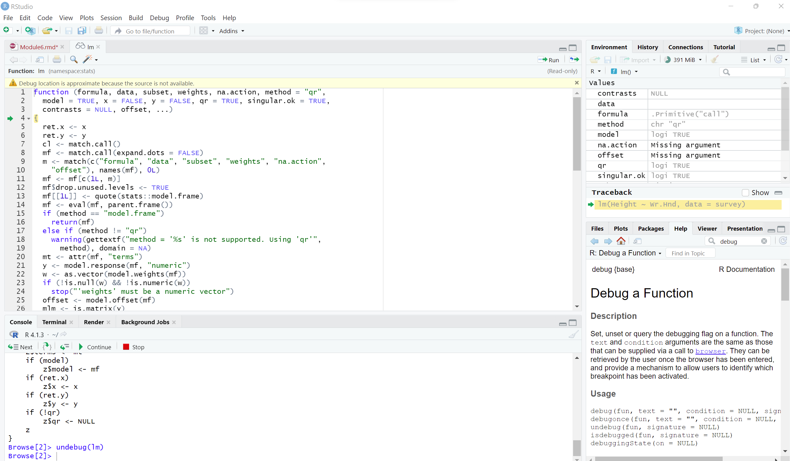

```{r}
# uncomment to debug a call to the lm function
#debug(lm)
#lm(Height ~ Wr.Hnd,data=survey)
#undebug(lm)
```

- browser() halts execution and invokes an environment browser when it is called. 
  - browser() can be inserted anywhere in your code to stop at that point in the code for debugging.

```{r}
fcn <- function(x, y) {
   z <- x*y
#   browser()  # uncomment to use browser function
   return(z*exp(z))
}
val <- fcn(2, 1.3)
```

### Using Try to Catch Exceptions

- When a function terminates from an error, it also terminates any parent functions
  - If function A calls function B and function B halts because of an error, this halts execution of A at the same point.
  - To avoid this, use a try statement to attempt a function call and check whether it produces an error

```{r}
attempt1 <- try(myfibrec2(0),silent=TRUE)
attempt1
```

- Using Try in a Function Body
  - The exception is caught and dealt in the function

```{r}
myfibvectorTRY <- function(nvec) {
          nterms <- length(nvec)
          result <- rep(0,nterms)
          for (i in 1:nterms) {
                  attempt <- try(myfibrec2(nvec[i]),silent=T)
                  if (class(attempt)=="try-error") {
                          result[i] <- NA
                  } else {
                          result[i] <- attempt
                  }
          }
          return(result)
}
myfibvectorTRY(0)
```

### system.time

- The system.time function can be used to see just how fast R code runs
  - system.time takes an R expression, runs it, and then displays how much time elapsed while the expression ran
  - Compare the abs_loop and abs_vec functions (from "Conditions and Loops" earlier in this module) by making a long vector of 100 million positive and negative numbers
  
```{r}
abs_loop <- function(vec) {   # create a function to set abs value
    for (i in 1:length(vec)) {
        if (vec[i] < 0) {
            vec[i] <- -vec[i]
        }
    }
    vec
}

abs_vec <- function(vec) {  # create a function to set abs value
    negs <- vec < 0
    vec[negs] <- vec[negs] * -1
    vec
}

long <- rep(c(-1, 1), 50000000)
system.time(abs_loop(long))
system.time(abs_vec(long))
```

    - user  system elapsed 
    - 1.03    0.21    1.23 

- The first two columns (user, system) of the output report how many seconds your computer spent executing the call in "user mode" and "system mode"
- The last column displays how many seconds elapsed while R ran the expression.
- The results show that abs_vec calculated the absolute value much faster than abs_loop
- You can expect similar speed-ups whenever you write vectorized code.

- Timing Built-In R Functions

- You can measure the speed of a built-in function (e.g. abs()) with system.time

```{r}
system.time(abs(long))
```

- Note that both custom functions are slower than the built-in.
- Built-in functions are optimized in R and should be used when available for the best performance

