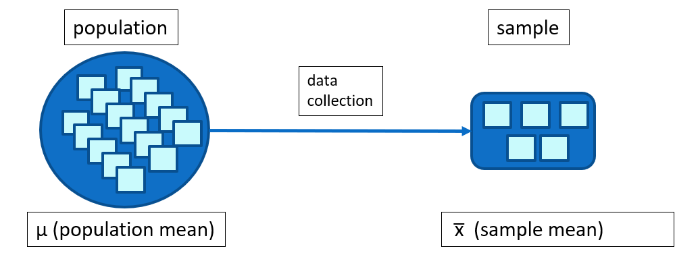
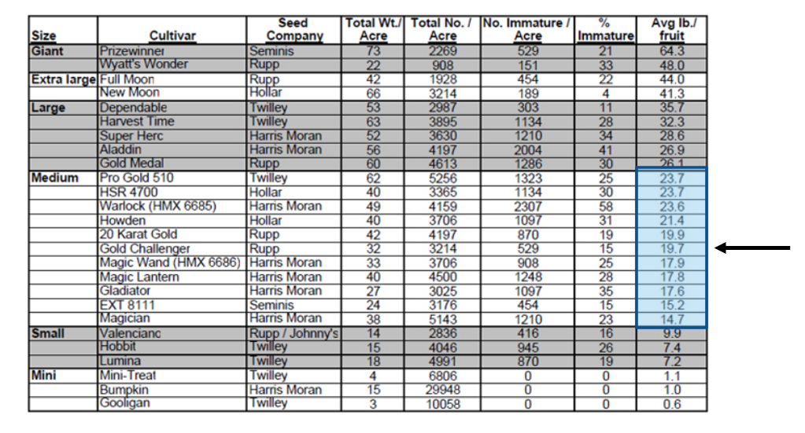
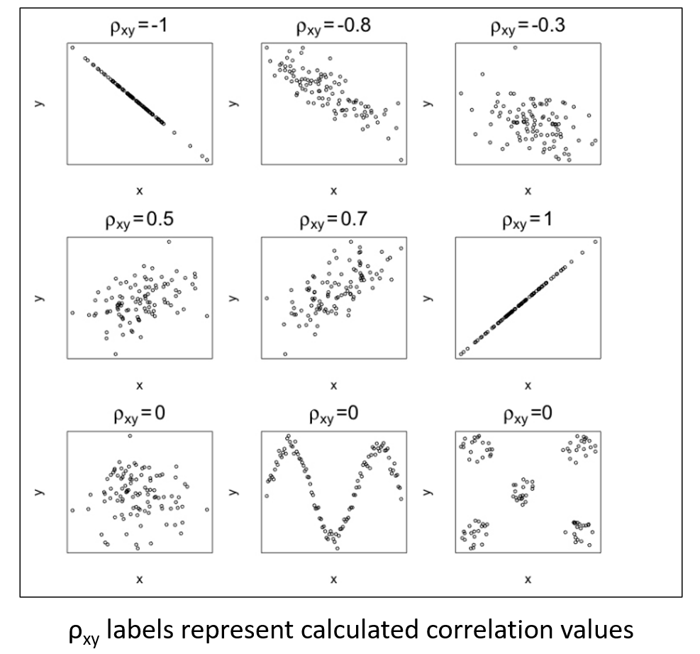
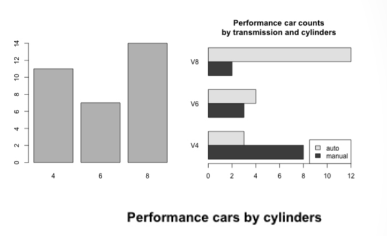
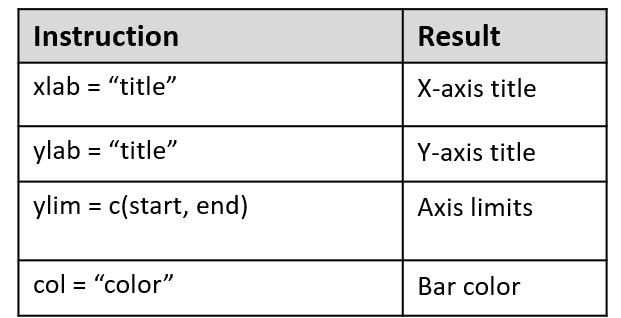
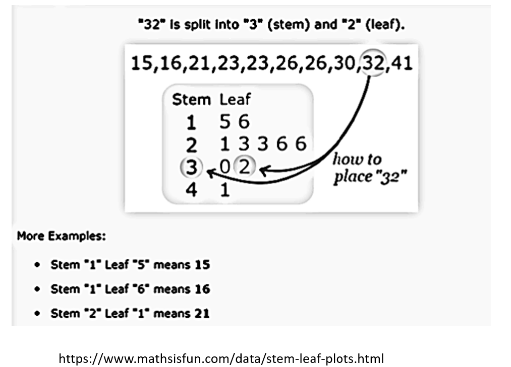
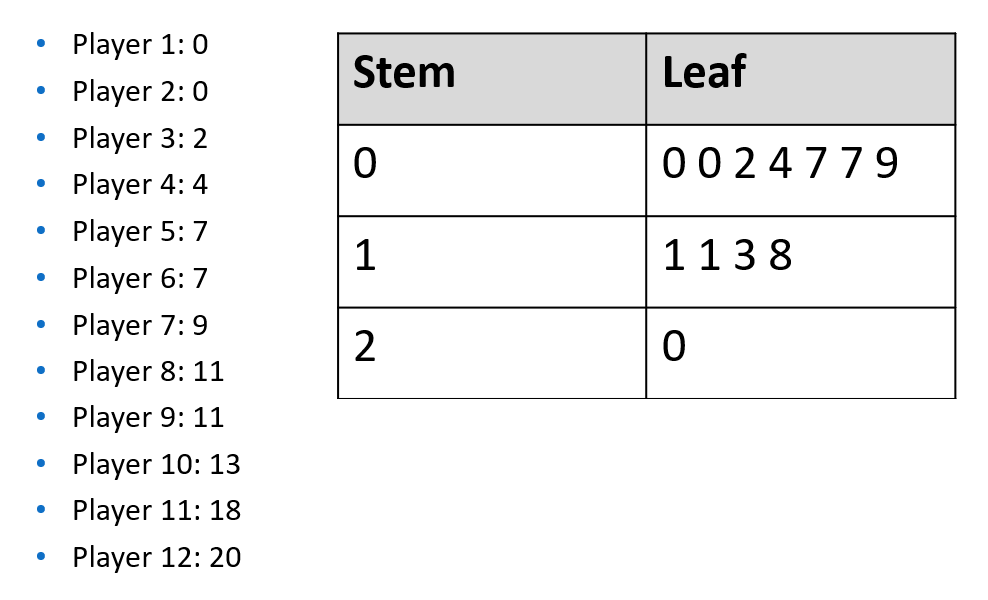
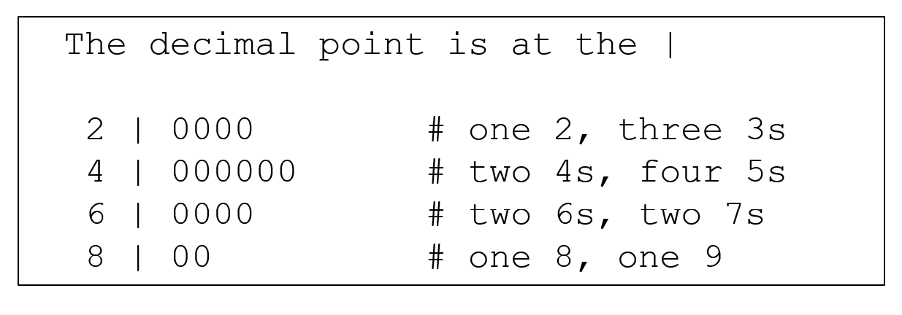
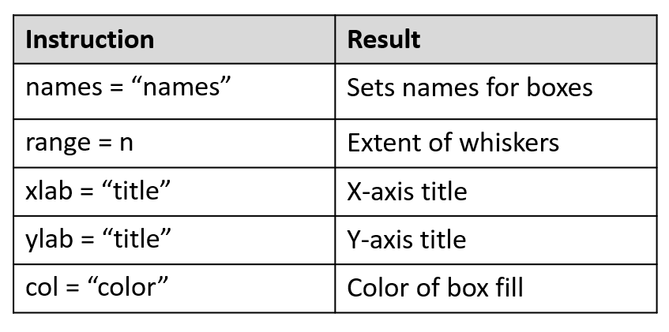

```{r rmarkdown-setup, echo = FALSE}
knitr::opts_chunk$set(warning = FALSE)
knitr::opts_chunk$set(message = FALSE)
```

## Module 7

## Basic Statistics in R

### Numeric Variables

-   There are two basic types of numeric variables in statistics:
    -   **continuous** variables: any value in some interval, up to any number
        of decimals - (which technically gives an infinite number of possible
        values) e.g.
        -   1.1, -3.0, 1678.5323
    -   **discrete** variables: only distinct numeric values
        -   If the range is restricted, then the number of possible values is
            finite
        -   e.g. 1, -27, 101, 3108

### Univariate and Multivariate Data

-   **Univariate** data refers to the use of a single relevant variable
    -   e.g. the weight of a car
-   **Multivariate** data consist of multiple variables, where their individual
    components aren't useful in a particular statistical analysis
    -   Bivariate is sometimes considered a sub-category of multivariate,
        referring specifically to two variables considered together, but can
        also considered distinct from a multivariate analysis which requires
        three or more variables
    -   Bivariate can be easily plotted on an x- and y- axis
    -   Multivariate depends on analysis context
        -   e.g. an analysis requires height and weight as dependent variables
        -   e.g. a geographic location measured in three dimensions (latitude,
            longitude, and altitude)

### Parameters vs. Statistics

-   Statistics as a discipline is concerned with understanding features of an
    entire collection of individuals or entities of interest, known as a
    **population**
    -   Parameters are the characteristics of a population (e.g. **μ** -- the
        **population** mean)
-   Researchers typically collect a **sample** of data **to represent a
    population** and use models to derive relevant information from that data
    -   Statistics are characteristics of the sample: **estimated** parameters
        derived from the sample (e.g. **x-bar** -- the **sample** mean)



### Summary Statistics

-   Measurements which summarize data include -Centrality: describe how large
    collections of data are centered
    -   e.g. mean, median, mode
    -   Range, Variance, Standard Deviation
        -   measure the spread of the data
    -   Counts, Percentages, and Proportions
        -   useful for categorical data
    -   Quantiles, Percentiles, and the Five-Number Summary
        -   describe the distribution of a dataset
    -   Covariance and Correlation
        -   demonstrate the relationship between two variables
-   Given the weight (in lbs) for various pumpkin samples in the "Medium" size
    category, use R to calculate various summary data values
    
### Pumpkin Data!



- "2007 Evaluation of Pumpkin Varieties for the Southeast"
<http://vegetables.tennessee.edu/Pumpkin/pumpkin2007_1.html>
- (note: this link is now broken)
- Immature pumpkins are unripe pumpkins

```{r}
weights <- c(23.7,23.7,23.6,21.4,19.9,19.7,    # Medium category only
            17.9,17.8,17.6,15.2,14.7)
meanw <- mean(weights)    # mean
medw <- median(weights)   # median
cat("mean=", meanw, "median=", medw, "\n")
sd(weights)    # standard deviation
range <- max(weights) - min(weights)  # range
range
```

- The mode is the value that appears most frequently in a data set.
- R has no statistical  "mode" function 
  - mode() in R is not the same (look it up)
  - A custom mode function can be written, many examples are available on the web
  - They all work in a similar fashion:
    - create a vector of unique values
    - count the number of indices for each unique value
    - get the element value of the maximum of the index with the highest count

```{r}
getmode <- function(v) {
  uv <- unique(v)
  uv[which.max(tabulate(match(v, uv)))]
}
getmode(weights)
```

### The tapply Function

- In calculating simple summary statistics, the R tapply function ('t' stands for 'table') can be used to compute statistics grouped by a specific categorical variable.
  - e.g. calculate the mean miles per gallon (mpg) for each cylinder value in the mtcars dataset

```{r}
tapply(mtcars$mpg,INDEX=mtcars$cyl,FUN=mean)
```

- use tapply on the pumpkin data

```{r}
# read the data
setwd("d:/fscj/WorkingConnections/WWC22-R/WWC2022/workbooks/day2")
pumpkin <- read.csv("pumpkin.csv")
# set the column names
names(pumpkin) <- c("Size","Num_Immature_Acre",
                    "Percent_Immature","Avg_lb")
# find the mean per size category
result <- tapply(pumpkin$Avg_lb,INDEX=pumpkin$Size,FUN=mean)
# it's alphabetical, sort it numerically
sort(result,decreasing=TRUE)
# use the custom getmode function to find the mode per size category 
result <- tapply(pumpkin$Avg_lb,INDEX=pumpkin$Size,FUN=getmode)
# sort it
sort(result,decreasing=TRUE)
```

### Quantiles

- A quantile is a value computed from a collection of numeric measurements that indicates an observation’s rank when compared to all the other observations
  - The median is a quantile which gives you a value below which half of the measurements lie, the 0.5th quantile
  - Quantiles are commonly expressed as a percentile on a “percent scale” of 0 to 100
  
```{r}
quantile(pumpkin$Avg_lb)
```

- Box plots (also known as "box and whisker" plots) are frequently used to represent percentiles (also known as "Five Number Summary Box Plots")

```{r}
boxplot(pumpkin$Avg_lb, horizontal=T, range=0)
```

### Variance

- Variance ("spread") measures dispersion of a dataset, ie. how spread out points are from the mean and one another
  - Variance of 0 means points are all the same
  - The var() function calculates sample variance
  - var() result is the square of the original sample data unit
    - e.g. if data is in feet, var() unit is square feet
  - as sample size increases, var() approaches population variance
  - var() is the square of the standard deviation sd()

```{r}
var(weights)         # variance of medium pumpkin category
var(pumpkin$Avg_lb)  # variance of all pumpkin weight categories

# plot the data to visualize it!
plot(weights, xlim=c(0,30), ylim=c(0,65))
abline(h=mean(weights),lwd=2,lty=3, col="gray")

plot(pumpkin$Avg_lb, xlim=c(0,30), ylim=c(0,65))
abline(h=mean(pumpkin$Avg_lb),lwd=2,lty=3, col="gray")
```

### Covariance and Correlation

- Covariance expresses how much two numeric variables “change together”
  - A positive covariance result shows that there is a positive linear relationship between the variables: as x increases, y increases
  - A negative covariance result shows a negative linear relationship: as x increases, y decreases
  - A covariance of 0 indicates no relationship
  - To calculate covariance, use the cov() function
- Correlation allows you to interpret covariance by identifying both the direction and the strength of any association
  - To calculate correlation, use the cor() function



```{r}
# show covariance, correlation and scatter plot for all pumpkins
# percent immature vs. weight
cov(pumpkin$Percent_Immature,pumpkin$Avg_lb)
cor(pumpkin$Percent_Immature,pumpkin$Avg_lb)
plot(pumpkin$Percent_Immature,pumpkin$Avg_lb)

# show covariance, correlation and scatter plot for medium category
# percent immature vs. weight
perc_imm <- pumpkin[10:20,3]
cov(perc_imm,weights)
cor(perc_imm,weights)
plot(perc_imm,weights)
```

- Example using mtcars dataset

```{r}
cov(mtcars$cyl,mtcars$mpg)
cor(mtcars$cyl,mtcars$mpg)
plot(mtcars$cyl, mtcars$mpg)
```

### Outliers

- An outlier is an observation that does not fit with the rest of the data
  - A noticeable extreme when compared with the bulk of the data
  - Outliers can occur naturally, where the outlier is an accurate observation recorded from the population, or unnaturally, where something has "contaminated" the sample, such as incorrect input
  - It is common to omit any outliers occurring through unnatural sources prior to analysis if they can be found
  - Identifying outliers is important because of the potential impact they can have on any statistical calculation 
  - Researchers try to identify possible outliers before computing results by conducting an exploratory analysis of their data using basic summary statistics and data visualization tools
  - In some cases, researchers conduct their analysis both ways, presenting results including and excluding perceived outliers

### Basic Data Visualization

- Barplots are commonly used to visualize qualitative data by category frequency.

- A barplot draws either vertical or horizontal bars, typically separated by white space, to visualize frequencies according to the relevant categories.



```{r}
# create a barplot from mtcars Dataset
# plot observations per cylinder (cyl) 
mtcars[1:5,]
cyl.freq <- table(mtcars$cyl)  # table() tabulates values
cyl.freq
barplot(cyl.freq)
```

```{r}
rain <- c(3, 5, 7, 5, 3, 2, 6, 8, 5, 6, 9, 8)
barplot(rain, names = month.abb)
```

### Customizing Barplots



```{r}
barplot(rain, xlab = 'Month', ylab = 'Rainfall cm',
        ylim = c(0,10), col = 'lightblue')
 
abline(h = seq(1,9,2), lty = 2, lwd = 0.5, col = 'gray40')

box() # draw box around plot
```

### Stem and Leaf Plots

- A stem and leaf plot is a special table where each data value is split into a "stem" (the first digit or digits) and a "leaf" (usually the last digit).



- Example: A statistician for a basketball team tracked the number of points that each of 12 players on the team had in one game, and then made a stem-and-leaf plot to show the data.



```{r}
data <- c(3, 5, 7, 5, 3, 2, 6, 8, 5, 6, 9, 4, 5, 7, 3, 4)
stem(data)
```



### Increasing the Number of Bins

```{r}
stem(data, scale=2)
```

### Stem and Leaf with Real Numbers
```{r}
data2 <- c(23.0, 17.0, 12.5, 11.0, 17.0, 12.0,  14.5,  
           9.0, 11.0, 9.0, 12.5, 14.5, 17.0, 8.0, 21.0)

stem(data2, scale=2)
```

### Histograms

- The barplot is sensible for counting observations in relation to categorical variables but is of virtually no use if the variable you’re interested in is numeric/continuous
  - Stem plots show original values and allow samples to be reconstructed, but are unwieldy with larger data sets
  - Histograms are the "classic" way to view a distribution of continuous measurements
  - Histograms are sometimes confused with barplots owing to their similar appearance

- A histogram plots continuous data by binning the number of continuous observations   - The size of this interval is known as the binwidth.
  - Consider the horsepower data of the 32 cars in the mtcars dataset

```{r}
hist(mtcars$hp)
```

  - This histogram uses binwidths of 50 units spanning the range of the data, centered roughly in the range of 75 to 150, tapering off on the right (this is known as a right or positive skew
  - The accuracy of a histogram as a representation of the shape of a distribution of measurements depends solely upon the widths of the intervals used to bin the data.
  
- Binwidths can be modified by supplying a vector of "breaks" to the hist command

```{r}
hist(mtcars$hp,breaks=seq(0,400,25),
  col="gray",main="Horsepower",xlab="HP")
abline(v=c(mean(mtcars$hp),median(mtcars$hp)),
      lty=c(2,3),lwd=2)
legend("topright",
      legend=c("mean HP","median HP"), lty=c(2,3),lwd=2)
```

### Boxplots

- Create box-whisker plots with the boxplot() command

```{r}
boxplot(mtcars$mpg,names=c('mpg'))
```



```{r}
boxplot(mtcars$mpg,names=c('mpg'),show.names=TRUE,
          horizontal=TRUE,xlab="value",col="green")
```

