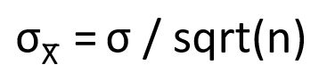
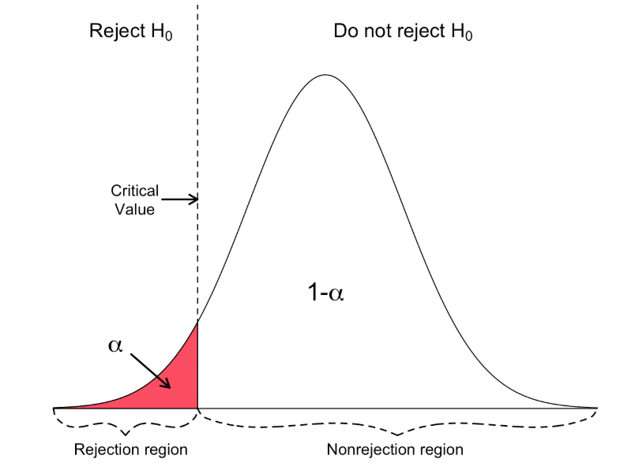
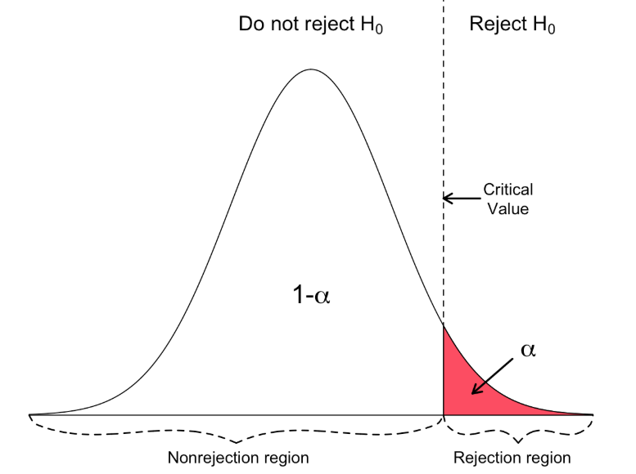
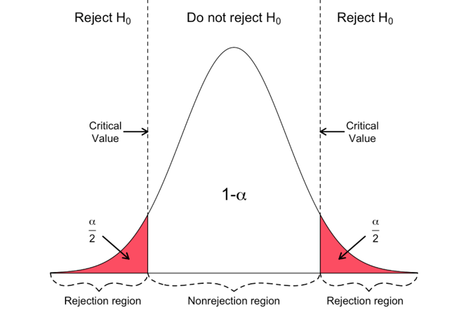
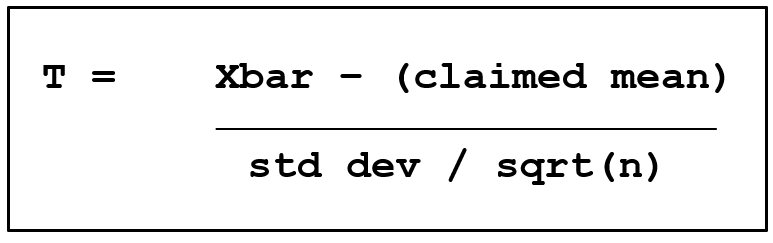
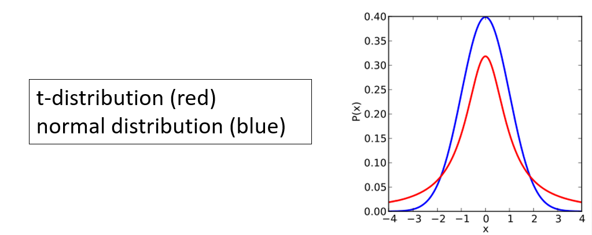
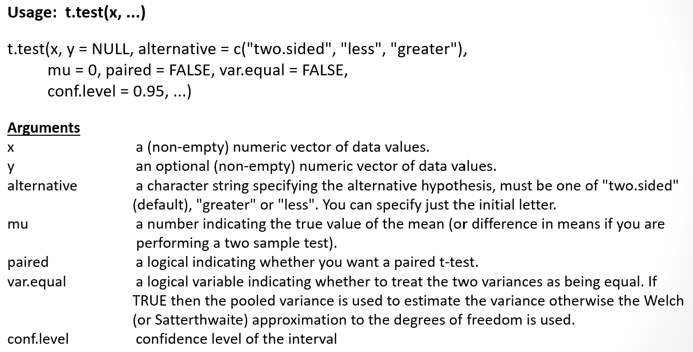
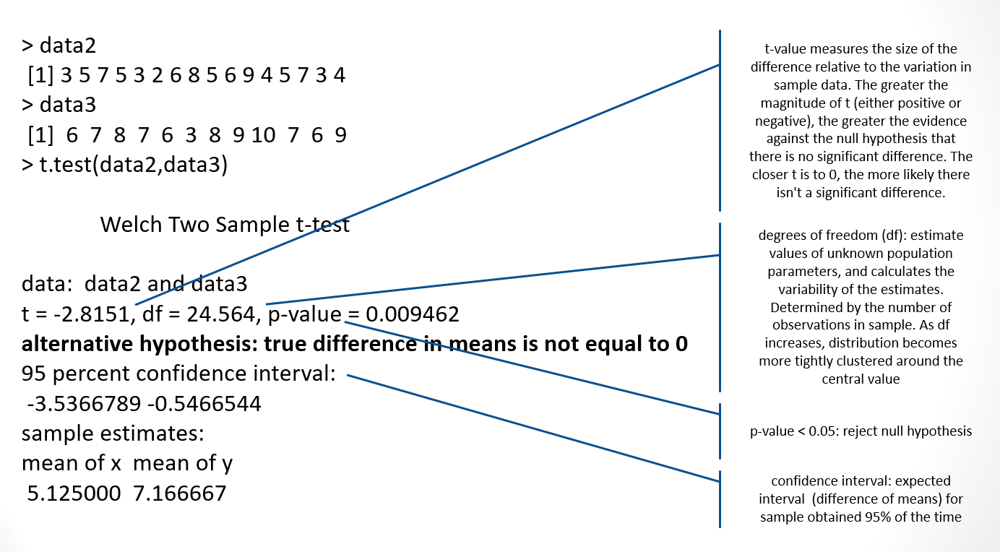

```{r rmarkdown-setup, echo = FALSE}
knitr::opts_chunk$set(warning = FALSE)
knitr::opts_chunk$set(message = FALSE)
```

## Module 8

## Advanced Statistics in R

### Ch. 17 Sampling Distributions and Confidence

-   A **sampling distribution** is a probability distribution that accounts for
    variability when population parameters are estimated using sample
    statistics.

    -   Modeling variability in an estimated sample statistic is a key part of
        many statistical analyses.

-   The sampling mean ("X-bar") is calculated using a smaller number of
    observations, so variability can decrease compared to a population mean.

-   The sampling standard deviation is referred to as the **standard error**
    ("sigma-X-bar") reflecting the fact that the probabilities are calculated
    from a sample.

-   The formulas for sampling distributions depend upon the probability
    distributions that generated the raw data, availability of measures of the
    population mean and standard deviation, and the size of the sample itself.

-   The formula to calculate the standard error for a sample distribution of
    size n given a known standard deviation σ is



### Normal Distributions

- Normal distributions follow a bell-curve, with consistent percentages of the
 data falling within (plus or minus) 1, 2 and 3 standard deviations of the mean.

### R Functions for Normal Distributions

```{r}
# uncomment for help page for normal distribution functions
#?Normal
```


Sample Distribution Example:

- Suppose that the daily maximum temperature in the month of January in Dunedin, New Zealand, follows a normal distribution, with a mean of 22 degrees Celsius and a standard deviation of 1.5 degrees
    - What is the probability that a randomly chosen day in January has a maximum temperature of less than 21.5 degrees?
    - What is the probability if the day is chosen from a random sampling of 5 days? (n = 5)

```{r}
# Pr(X < 21.5)          /// population
pnorm(21.5, mean=22, sd=1.5)

# Pr(Xbar < 21.5)       /// sample
pnorm(21.5, mean=22, sd=1.5/sqrt(5))
```

### Confidence Intervals

- A confidence interval (CI) defines a range of values with a specified probability that the value of a parameter lies within them.
- A CI allows you to state a “level of confidence” that the parameter falls between an lower and upper limit, often expressed as a percentage. 
- The confidence interval is defined using a value α, which represents the likelihood that the parameter lies outside the confidence interval
- The three most common intervals are α = 0.1 (90 percent interval), α = 0.05 (95 percent interval), or α = 0.01 (99 percent interval)
- The interpretation of a confidence interval (l,u) is stated as "there is a ((1- α) * 100)% confidence level that the parameter value lies somewhere between l and u"

### Finding Confidence Intervals with R

- Suppose we’ve collected a random sample of 10 recently graduated students and collected their annual salaries:

> salaries <- c(44617,7066,17594,2726,1178,18898,5033,37151,4514,4000)

- Estimate the mean salary of all recently graduated students. Find a 90% and a 95% confidence interval for the mean.
- Assume that incomes are normally distributed with an unknown mean and a standard deviation of $15,000
- Xbar is the sample mean
- To calculate a confidence interval use
  - Xbar +- (plus or minus) the Z-score of α /2 times the standard error
- Given n = 10 and σ = 15000, this is
  - CI(α) = Xbar +- z(α/2) * (15000 /sqrt(10))

### Calculate the 90% CI

- α = 0.10
- Use qnorm to calculate the Z-score of α/2 = z(0.05)

```{r}
salaries <- c(44617,7066,17594,2726,1178,18898,5033,37151,4514,4000)
z <- qnorm(.05)
xbar <- mean(salaries)  # sample mean
sterr <- (15000 /sqrt(10))  # standard error
lb <- xbar + z * sterr  # lower CI bound
ub <- xbar - z * sterr  # upper CI bound
cat('The 90% CI is (', lb, ',', ub, ')\n')
```

### Calculate the 95% CI

- For a 95% CI, α = 0.05.
  - All of the steps are the same, except replace z(.05) with z(.025)

```{r}
salaries <- c(44617,7066,17594,2726,1178,18898,5033,37151,4514,4000)
z <- qnorm(.025)
xbar <- mean(salaries)  # sample mean
sterr <- (15000 /sqrt(10))  # standard error
lb <- xbar + z * sterr
ub <- xbar - z * sterr
cat('The 95% CI is (', lb, ',', ub, ')\n')
```

- Note that the range for 95% is larger, a tradeoff for the higher CI

### Ch. 18 Hypothesis Testing

- Hypothesis testing defines a **null** and an **alternative** hypothesis
- The null and alternative hypotheses are denoted H0 and HA, respectively (sometimes H0 and H1, or H0 and H1)
- The null hypothesis is interpreted as the baseline and is assumed to be true
- The alternative hypothesis is the item that you are testing against the null hypothesis and is determined before any data are collected
- The alternative hypothesis takes the form of either an upper-tailed, lower-tailed, or  two-tailed test

- When HA is defined in terms of a "less-than" statement, it is one-sided and lower-tailed.
  - H0 is rejected if the test statistic is smaller than the critical value.
- When HA is defined in terms of a "greater-than" statement, it is one-sided and upper-tailed.
  - H0 is rejected if the test statistic is larger than the critical value.
- When HA is defined in terms of a "not-equal" statement, it is two-sided, or two-tailed.
  - H0 is rejected if the test statistic is smaller or larger than the critical value.

### Hypothesis Test Example

- The null hypothesis is usually a hypothesis of "there is no difference"
  - H0 = "there is no difference between blood pressures in group A and group B if we give group A the test drug and group B a sugar pill."
- Always define a null hypothesis for each question clearly before the start of a study.
- The alternative hypothesis (HA) is the opposite of the null hypothesis; this is usually the hypothesis you set out to investigate
  - HA = "there is a difference in blood pressures between groups A and B if we give group A the test drug and group B a sugar pill".

  <https://www.statsdirect.com/help/basics/p_values.htm>

### The p-value

- The p-value, or calculated probability, is the probability of finding results when the null hypothesis (H0) of a study question is true
- The p-value is used to quantify the amount of evidence, if any, against the null hypothesis
- The exact nature of calculating a p-value is dictated by the type of statistics being tested and the nature of the alternative hypothesis
  - A lower-tailed test implies the p-value is the left-hand tail probability from the sampling distribution of interest
  - For an upper-tailed test, the p-value is the right-hand tail probability
  - For a two-sided test, the p-value is the sum of a left-hand tail probability and right-hand tail probability (2x the area in either tail for symmetric distributions)

### The Test Statistic

- The test statistic is compared to the appropriate standardized sampling distribution to yield the p-value
- Test statistics frequently use Z-scores for normal distributions, or t-scores using t-distributions for small sample sizes (usually less than 30) or when the population standard deviation is unknown
- The distribution and distance from zero of the test statistic determine the size of the p-value
  - The more extreme the test statistic, the smaller the p-value
  - The smaller the p-value, the greater the amount of statistical evidence against the assumed truth of H0
  
### Significance Level

- For every hypothesis test, a significance level α is assumed. 
- The significance level defines a cutoff point, at which you decide whether there is sufficient evidence to view H0 as incorrect and favor HA instead.
  - If the p-value is greater than or equal to α, then you conclude there is insufficient evidence against the null hypothesis, and therefore you retain H0 when compared to HA
  - If the p-value is less than α, then the result of the test is statistically significant. This implies there is sufficient evidence against the null hypothesis, and therefore you reject H0 in favor of HA

### Lower-Tailed Tests

- For lower-tailed tests, the rejection region consists of one part, left from the center.



<https://www.geo.fu-berlin.de/en/v/soga/Basics-of-statistics/Hypothesis-Tests/Introduction-to-Hypothesis-Testing/Critical-Value-and-the-p-Value-Approach/index.html>

### Upper-Tailed Tests

- For upper-tailed tests, the rejection region consists of one part, right of center.



### Two-Tailed Tests

- For two-tailed tests, the rejection region consists of two parts, one on the left and one on the right.



### Practice: Single Mean Test Using pt Function

- A manufacturer of a snack advertises a package of snacks has a mean net weight of 80 grams. 
- A consumer calls in with a complaint—over time they have bought and precisely weighed the contents of 44 randomly selected 80-gram packs from different stores and recorded the weights as follows:

> snacks <- c(87.7,80.01,77.28,78.76,81.52,74.2,80.71,79.5,77.87,81.94,80.7,
               82.32,75.78,80.19,83.91,79.4,77.52,77.62,81.4,74.89,82.95,
               73.59,77.92,77.18,79.83,81.23,79.28,78.44,79.01,80.47,76.23,
               78.89,77.14,69.94,78.54,79.7,82.45,77.29,75.52,77.21,75.99,
               81.94,80.41,77.7)

- The customer claims that they’ve been shortchanged because their data cannot have arisen from a distribution with mean μ = 80, so the true mean weight must be less than 80. 
- To investigate this claim, the manufacturer conducts a hypothesis test using a significance level of α = 0.05.

- First, the hypotheses must be defined.
- The null hypothesis H0, is that the mean net weight μ is 80 grams. 
- The alternative hypothesis HA, or “what we are testing for”, is that μ is smaller than 80.
- These hypotheses are formalized as

  - H0: μ = 80
  - HA: μ < 80

- Second, the mean and standard deviation must be estimated from the sample.

```{r}
snacks <- c(87.7,80.01,77.28,78.76,81.52,74.2,80.71,79.5,77.87,81.94,80.7,
               82.32,75.78,80.19,83.91,79.4,77.52,77.62,81.4,74.89,82.95,
               73.59,77.92,77.18,79.83,81.23,79.28,78.44,79.01,80.47,76.23,
               78.89,77.14,69.94,78.54,79.7,82.45,77.29,75.52,77.21,75.99,
               81.94,80.41,77.7)
n <- length(snacks)
# calculate the mean
snack.mean <- mean(snacks)
snack.mean

# calculate the standard deviation
snack.sd <- sd(snacks)
snack.sd

```

- Given the estimated standard deviation, what is the probability of observing a sample mean (n = 44) of 78.91 (the calculated sample mean) grams or less if the true (advertised) mean is 80 grams?
- To answer this, we need to calculate the relevant test statistic:



```{r}
snack.se <- snack.sd / sqrt(n)
snack.se
snack.T <- (mean(snacks)- 80) / snack.se
snack.T

# use the test statistic to calculate the p-value
# with the pt function (use n − 1 degrees of freedom)
pt(snack.T,df=n-1)
```

- This p-value is smaller than the predefined significance level of α = 0.05
- The manufacturer can conclude that there is sufficient evidence to reject the null hypothesis in favor of the alternative, suggesting the true value of μ is in fact less than 80 grams

### The t-distribution

- A t-distribution is any member of a family of continuous probability distributions that arises when estimating the mean of a normally distributed population in situations where the sample size is small and the population standard deviation is unknown
  - Developed by William Sealy Gosset under the pseudonym Student         
  <http://www.swlearning.com/quant/kohler/stat/biographical_sketches/bio12.1.html>
  - The t-distribution is symmetric and bell-shaped, like the normal distribution, but has "heavier" tails



### Student's t-Test using t.test()

- Student's t-test compares two samples to determine if they are different using the means of both samples
  - goal is evidence of a significant difference between population means (2-sample t) or between the population mean and a hypothesized value (1-sample t)
  - t-value measures the size of the difference relative to the variation in your sample data
  - t.test() is another (simpler) way to calculate a confidence interval
  




### Using t.test() to Analyze Movies

- It's Friday night and you want to watch a movie. There are three movies that caught your eye, but you're not really sure if they're good or not.
  - In this modern day and age, you're that kind of person that still relies on family and friends for recommendations. So, you ask them to rate those movies and get ready to crunch the data.
  
- Movie Ratings (1-5 stars)

  - Interstellar:
    - 3 stars: 8
    - 4 stars: 13
    - 5 stars: 24

> m_in <- c(rep(3,8), rep(4,13), rep(5,24))

  - Star Wars: Last Jedi:
    - 3 stars: 3
    - 4 stars: 14
    - 5 stars: 27

> m_sw <- c(rep(3,3), rep(4,14), rep(5,27))

  - The Emoji Movie:
    - 1 star: 5
    - 2 stars: 27
    - 3 stars: 12

> m_em <- c(rep(1,5), rep(2,27), rep(3,12))

```{r}
# set up the data, calculate summary stats
m_in <- c(rep(3,8), rep(4,13), rep(5,24))
m_sw <- c(rep(3,3), rep(4,14), rep(5,27))
m_em <- c(rep(1,5), rep(2,27), rep(3,12))

mean_in <- mean(m_in)
mean_sw <- mean(m_sw)
mean_em <- mean(m_em)

median_in <- mean(m_in)
median_sw <- median(m_sw)
median_em <- median(m_em)

sd_in <- sd(m_in)
sd_sw <- sd(m_sw)
sd_em <- sd(m_em)
```

<https://towardsdatascience.com/hypothesis-testing-in-real-life-47f42420b1f7>

- Define the hypothesis

  - The null hypothesis (H0) states that all things remain equal. No phenomena is observed or there is not relationship between what you are comparing
  - The alternative hypothesis (HA): states the opposite of the null Hypothesis. That there was some change, or observed relationship between what you are comparing
  - For your movie choices, you want to know if one movie is significantly better than the others.
    - In this case, you can build your hypothesis on the difference between the average rating your friends gave to each movie.

- Null hypothesis (H0): The mean of movie A is equal to the mean of movie B 
- Alternative hypothesis (HA): The mean of movie A is not equal to the mean of movie B

  - H0: μA = μB
  - HA: μA ≠ μB

- The goal of the test is to reject the null hypothesis with confidence
- The Welch's t-test (default for t.test) is also called the unequal variances t-test 
  - Requires data to be normally distributed but takes into account differences in standard deviations

- Specify the Significance Level

  - α (alpha) specifies the probability of rejecting the null hypothesis when it was actually true
    - The significance levels that are normally used are 1% and 5%
    - Confidence interval of 95% indicates 5% significance level
  - t.test() uses a default confidence interval of 95%
    - (conf.level = 0.95)
  - also defaults to non-equal standard deviations
    - (var.equal = FALSE)

- Test 1
  - Compare "Interstellar" to "Star Wars: Last Jedi"

```{r}
t.test(m_in,m_sw)
```

- From these results (low t-value, p-value > 0.05) you cannot prove a statistically significant difference between reviews of the two movies.
  - We cannot say the Null Hypothesis is true, so we say there is not enough evidence to reject the Null hypothesis

- Test 2
  - Compare "Interstellar" to "The Emoji Movie"

```{r}
t.test(m_in,m_em)
```

- From these results (higher t-value, very small p-value) you can claim that there is a  statistically significant difference between reviews of the two movies.
  - We can safely reject the null hypothesis (stating there is no statistically significant difference in the ratings of the movies).

### Criticisms of Hypothesis Testing

- The end result of any hypothesis test is dependent upon the arbitrary choice of α, usually set at one of the conventionally used values
- A p-value never provides “proof” of either H0 or HA being truly correct
- The p-value indicates the strength of this preference of HA over H0
- It can only quantify evidence against the null hypothesis
- Rejecting a null hypothesis is not the same as disproving it.
- The best way to improve the use and interpretation of hypothesis testing is to understand what it can and cannot tell you

### Ch. 19 Analysis of Variance

- ANOVA

- Analysis of variance (ANOVA) is used to compare multiple means in a test for equivalence.
  - Measures variation between groups
  - Similar to t-test for two groups, but more conservative
  - Null hypothesis: the mean is the same for all groups
- ANOVA testing reveals that either
    - H0: cannot be rejected -- no significant difference exists
  - or
    - HA: H0 can be rejected -- a significant difference exists
  - but it does not reveal where the difference comes from

- The F-test

- An F-test is used in ANOVA  to compare overall deviation from the observed population mean.
  - F-tests are named after the test statistic, F, which was named in honor of Sir Ronald Fisher. 
  - The F-statistic is a ratio of two variances as a measure of dispersion, or how far the data are scattered from the mean.
    - Larger values represent greater dispersion.
  - As values of F increase above 1, the evidence is increasingly inconsistent with the null hypothesis.
  - The probability (p-value) of a value of F greater than or equal to the observed value is calculated. The null hypothesis is rejected if this probability is less than or equal to the significance level (α).

### One-Way ANOVA

- The simplest version of ANOVA is referred to as one-way or one-factor analysis.
- The one-way ANOVA is used to test two or more means for equality.
- Example: 
  - PlantGrowth (dataset included with the base-R distribution)
  - Results from an experiment to compare yields (as measured by dried weight of plants) obtained under a control and two different treatment conditions.
  - Format
  - A data frame of 30 cases on 2 variables
    - [, 1]	weight	(numeric)
    - [, 2]	group	(factor)

  - The levels of group are ‘ctrl’, ‘trt1’, and ‘trt2’

- Summarize the data

```{r}
str(PlantGrowth)
head(PlantGrowth)
summary(PlantGrowth)
```

- Plot the data; what do you think? Does Treatment 1 or Treatment 2 have a statistically relevant effect on the weight of the plants?

```{r}
# the ~ symbol is used in formula notation, see below
boxplot(weight ~ group, data = PlantGrowth)
```

- We want to know if there is a significant statistical difference between the average weights of the plants in the 3 experimental conditions
- Before doing the analysis we need to take a detour and look at formula notation so we understand how it is used in the steps we will take

### Formula Notation

- Formula notation in R allows complicated expressions to be specified.
  - Allows values of variables to be captured ("quoted") without evaluation.
  - Allows variables inside data frames to be easily accessible.
  - Basic syntax allows flexibility:
    - y ~ x1 + x2 + ..., data = data

    - y = response variable
    - x1... = predictor variables
    - data = the data object that holds the variables

  - the names for y and xN variables change depending on the context.
  - y = response = dependent = controlled = feature
  - xN = predictor = independent = outcome = label

- Formulas are Objects in R

```{r}
f <- y ~ x
f

class(f)

typeof(f)

attributes(f)
```

### One-sided or Two-sided Formulas

- Depending on the context within a function, a one-sided or two-sided formula may be used

```{r}
e <- ~ x + y          # one-sided
f <- y ~ x + b        # two-sided

e

f
```

### One-Way ANOVA

- Continuing our analysis…
  - We want to know if there is any significant difference between the average weights of plants in the 3 experimental conditions.
  - The aov() function can be used to answer to this question
  - This function will create a regression object, which in its raw form isn't that interesting to us, see below for how to use it

```{r}
aov(weight ~ group, data=PlantGrowth)
```

- The regression object created by the aov() function can be passed to the summary function to give us the desired results (note the F value and p-value)

```{r}
pg.aov <- aov(formula = weight ~ group, data = PlantGrowth)
summary(pg.aov)
```

- Remember that according to the "F-test", as values of F increase above 1, the evidence is increasingly inconsistent with the null hypothesis. 
- Since the p-value (labeled "Pf(>F)" in this data) is less than the significance level (0.05 in this example), we have evidence against the null hypothesis H0 (there is no significant difference between the groups).

### Two-Way ANOVA

- In many studies, the numeric outcome variable you’re interested in will be categorized by more than just one grouping variable. 
  - In these cases, you would use a "multiple-factor" ANOVA rather than the one-way ANOVA. 
  - This technique is directly referred to by the number of grouping variables used, with two- and three-way ANOVA being the next and most common extensions.
  - Increasing the number of grouping variables complicates matters, but performing just a one-way ANOVA for each variable separately is inadequate.
