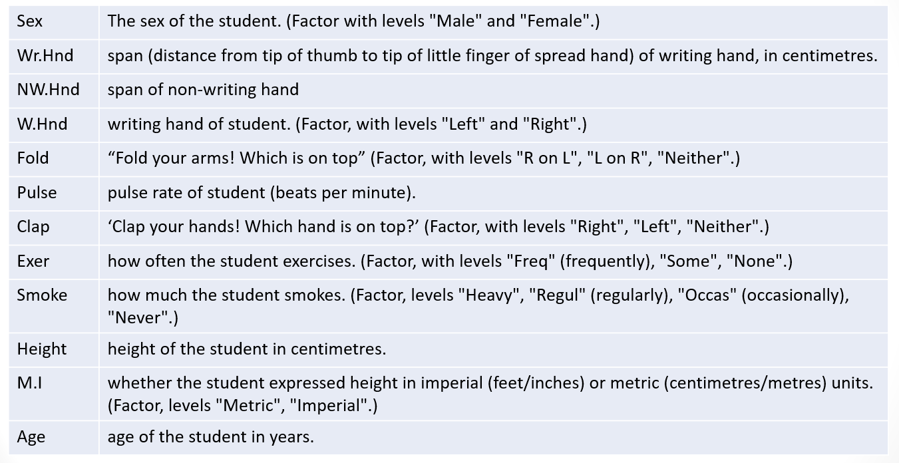
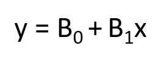
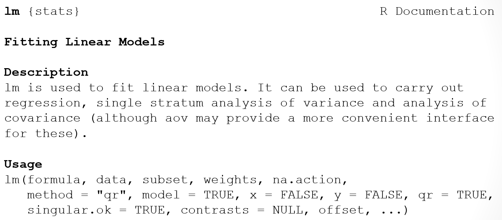

```{r rmarkdown-setup, echo = FALSE}
knitr::opts_chunk$set(warning = FALSE)
knitr::opts_chunk$set(message = FALSE)
```

## Module 9

## Advanced Statistics in R: Regression

### Simple Linear Regression

-0 Linear regression explains the relationship between a dependent variable and one or more independent variables
  - Other names for the dependent variable: outcome variable, response variable
  - Other names for the independent variable: predictor variable, explanatory variable
  - An example follows which uses the Rbase MASS dataset

```{r}
library(MASS)
? survey
```

### MASS Survey DataFormat


- Plot student height vs. writing-hand handspan
  - Note the use of formula notation ~ 
  - "height is a function of handspan"
    - or 
  - "height on handspan"
- Clustering indicates a positive linear relationship

```{r}
plot(survey$Height ~ survey$Wr.Hnd,
     xlab="Writing handspan (cm)",
     ylab="Height (cm)")
```

- The dataset contains some missing values, we can use which(is.na …) to find them

```{r}
which(is.na(survey$Height) | is.na(survey$Wr.Hnd))
incomplete.obs <- which(is.na(survey$Height)|is.na(survey$Wr.Hnd))
length(incomplete.obs)
```

### Correlation Coefficient

- Calculate the correlation coefficient using cor( ) function to assess strength of the relationship
  - Range of coefficient values is -1 to +1, where -1 is a perfect negative correlation and +1 is a perfect positive correlation
    - "use" parameter indicates method for dealing with missing values; "complete.obs" means missing values are handled by casewise deletion (and if there are no complete cases, that gives an error)

```{r}
# moderately strong positive correlation
cor(survey$Wr.Hnd,survey$Height,use="complete.obs")
```

### Model Definition

- The simple linear regression model states that changes in a response (dependent) variable are due to a change in an explanatory (independent) variable plus or minus a residual error value
  - The goal is to estimate the coefficients of B0 and B1 in the following equation:
  


- where B0 is the y-intercept and B1 is the slope of the fitted line (notice the similarity between this equation and the more familiar one for a straight line y = mx + b)
  - In R, the **lm** function performs the estimation for you.

### The lm Function



- Use lm to fit a linear model of the mean student height by handspan, store it as survfit
  - Height is the response, Wr.Hnd is the predictor
  - ~ is "formula notation" for data (see ?lm)

```{r}
survfit <- lm(Height ~ Wr.Hnd,data=survey)
survfit
# so here is our model: y = 113.954 + 3.117x 
```

- Run the plot again, but this time add the fitted regression line: 

```{r}
survfit <- lm(Height~Wr.Hnd,data=survey)
plot(survey$Height ~ survey$Wr.Hnd,
     xlab="Writing handspan (cm)", ylab="Height (cm)")
abline(survfit,lwd=2)
```

- The fitted line is referred to as a least-squares regression because it minimizes the average squared difference between the observed data and itself
- To calculate distances – known as "residuals" -- between selected observed points and the fitted line, choose two observed values from the dataset, refer to them as obsA and obsB


```{r}
obsA <- c(survey$Wr.Hnd[197],survey$Height[197])
obsB <- c(survey$Wr.Hnd[154],survey$Height[154])
obsA
obsB
```

- Call the coef() function to use the coefficients from the regression model to calculate the distances between the  points and the fitted line, and plot the results as segments

```{r}
mycoefs <- coef(survfit)
mycoefs
b0 <- mycoefs[1]
b1 <- mycoefs[2]
plot(survey$Height ~ survey$Wr.Hnd, xlab="Writing handspan (cm)", ylab="Height (cm)")
abline(survfit,lwd=2)
segments(x0=c(obsA[1],obsB[1]),y0=b0+b1*c(obsA[1],obsB[1]),
      x1=c(obsA[1],obsB[1]),y1=c(obsA[2],obsB[2]),lwd=3,lty=2)
```

### Evaluating the Model

- To determine if the linear model is appropriate for this data, look for a lack of a pattern in a plot of the residuals
  - Residual points should appear random

```{r}
survfit.resid <- resid(survfit)
complete.obs <- which(
        !is.na(survey$Height) &            
        !is.na(survey$Wr.Hnd))
plot(survey$Wr.Hnd[complete.obs], 
       survfit.resid, 
       ylab="Residuals",
       xlab="Writing Handspan (cm)", 
       main="Residuals for HandSpan")
abline(0,0)
```

### Statistical Inference

- Is there statistical evidence to support a relationship between the predictor and the response?
  - Model-based inference is carried out by R when lm objects are processed.
- Use the summary function on the model created by lm to determine:
  - the significance associated with the regression coefficients 
  - the interpretation of the coefficient of determination (labeled R-squared in the output)
- A small p-value is strong evidence against the claim that the predictor has no effect on the response
  - Signifance codes, e.g. ***, indicate level of statistical signifance

- summary( ) provides the values of Multiple R-squared and Adjusted R-squared
  - Both of these are referred to as the coefficient of determination; they describe the proportion of the variation in the response that can be attributed to the predictor.
  - For simple linear regression, the first (unadjusted) measure is simply the square of the estimated correlation coefficient (as a percentage)
  - The adjusted measure is an alternative quality metric covered in Ch. 22 of the text, not in the scope of this course

```{r}
summary(survfit)
```

- Multiple R-squared:  0.3612,	Adjusted R-squared:  0.3581 
  - 36.1 percent of the variation in the student heights can be attributed to handspan
